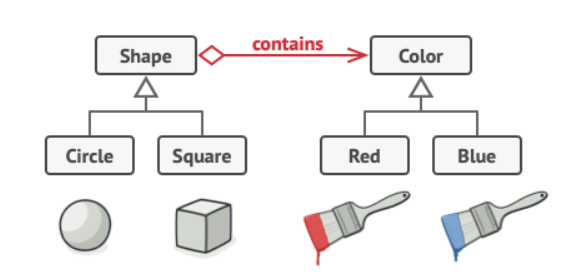

# Interview Preparation on Design Patterns

## Index
- [Interview Preparation on Design Patterns](#interview-preparation-on-design-patterns)
  - [Index](#index)
  - [🚀 Topics covered from javatpoint](#-topics-covered-from-javatpoint)
    - [🍃 SOLID principles](#-solid-principles)
    - [🍂 Single Responsibility Principle (SRP)](#-single-responsibility-principle-srp)
    - [🍂 Open/Closed Principle (OCP)](#-openclosed-principle-ocp)
    - [🍂 Liskov Substitution Principle (LSP)](#-liskov-substitution-principle-lsp)
    - [🍂 Interface Segregation Principle (ISP)](#-interface-segregation-principle-isp)
    - [🍂 Dependency Inversion Principle (DIP)](#-dependency-inversion-principle-dip)
    - [🍃 Types of Design Patterns.](#-types-of-design-patterns)
    - [🍃 Creational Design Pattern](#-creational-design-pattern)
    - [🍂 Singleton Pattern](#-singleton-pattern)
    - [🍂 Factory Method Pattern](#-factory-method-pattern)
    - [🍂 Abstract Factory Pattern](#-abstract-factory-pattern)
    - [🍂 Builder Pattern](#-builder-pattern)
    - [🍂 Prototype Pattern](#-prototype-pattern)
    - [🍃 Structural Design Patterns](#-structural-design-patterns)
    - [🍂 Adapter Pattern](#-adapter-pattern)
    - [🍂 Bridge Pattern](#-bridge-pattern)
    - [🍂 Composite Pattern](#-composite-pattern)
    - [🍂 Decorator Pattern](#-decorator-pattern)
    - [🍂 Facade Pattern](#-facade-pattern)
    - [🍂 Flyweight Pattern](#-flyweight-pattern)
    - [🍂 Proxy Pattern](#-proxy-pattern)
    - [🍃 Behavioral Design Patterns](#-behavioral-design-patterns)
    - [🍂 Chain of Responsibility Pattern](#-chain-of-responsibility-pattern)
    - [🍂 Command Pattern](#-command-pattern)
    - [🍂 Iterator Pattern](#-iterator-pattern)
    - [🍂 Mediator Pattern](#-mediator-pattern)
    - [🍂 Memento Pattern](#-memento-pattern)
    - [🍂 Observer Pattern](#-observer-pattern)
    - [🍂 State Pattern](#-state-pattern)
    - [🍂 Strategy Pattern](#-strategy-pattern)
    - [🍂 Template Pattern](#-template-pattern)
    - [🍂 Visitor Pattern](#-visitor-pattern)

<br><br>

## 🚀 Topics covered from javatpoint

### 🍃 SOLID principles
- Single Responsibility Principle (SRP)
- Open/Closed Principle (OCP)
- Liskov Substitution Principle (LSP)
- Interface Segregation Principle (ISP)
- Dependency Inversion Principle (DIP)

<br><br>

### 🍂 Single Responsibility Principle (SRP)
A class should have one, and only one, reason to change. (only one responsibility)

```java
class Employee {
    public void save() {
        // save employee
    }
    public void update() {
        // update employee
    }
    public void delete() {
        // delete employee
    }
}
```
here, the Employee class has multiple responsibilities like save, update, and delete. So, we can create separate classes for each responsibility.

```java
class Save {
    public void save() {
        // save employee
    }
}

class Update {
    public void update() {
        // update employee
    }
}

class Delete {
    public void delete() {
        // delete employee
    }
}
```

<br><br>

### 🍂 Open/Closed Principle (OCP)
Software entities should be open for extension, but closed for modification.

```java
class Circle {
    public void draw() {
        // draw circle
    }
}

class Square {
    public void draw() {
        // draw square
    }
}
```
here, if we want to add a new shape like a rectangle, then we have to modify the existing classes. So, we can create an interface Shape and implement it in the classes.

```java
interface Shape {
    void draw();
}

class Circle implements Shape {
    public void draw() {
        // draw circle
    }
}

class Square implements Shape {
    public void draw() {
        // draw square
    }
}
```

<br><br>

### 🍂 Liskov Substitution Principle (LSP)
Objects of a superclass shall be replaceable with objects of its subclasses without affecting the functionality of the program.

```java
class Bird {
    public void fly() {
        // fly
    }
}

class Ostrich extends Bird {
    public void fly() {
        throw new UnsupportedOperationException("Ostrich can't fly");
    }
}
```
here, the Ostrich class is a subclass of the Bird class. But, the Ostrich class can't fly. So, it violates the Liskov Substitution Principle. So, we can create a separate class for the Ostrich.

```java
class Bird {
    public void fly() {
        // fly
    }
}

class Ostrich {
    public void run() {
        // run
    }
}
```

<br><br>

### 🍂 Interface Segregation Principle (ISP)
A client should never be forced to implement an interface that it doesn't use or clients shouldn't be forced to depend on methods they do not use.

```java
interface Worker {
    void work();
    void eat();
}

class WorkerImpl implements Worker {
    public void work() {
        // work
    }
    public void eat() {
        // WorkerImpl doesn't need this method
    }
}
```
here, the Worker interface has two methods work() and eat(). But, the WorkerImpl class doesn't need the eat() method. So, we can create separate interfaces for work and eat.

```java
interface Workable {
    void work();
}

interface Eatable {
    void eat();
}

class WorkerImpl implements Workable {
    public void work() {
        // work
    }
}
```

<br><br>

### 🍂 Dependency Inversion Principle (DIP)
High-level modules should not depend on low-level modules. Both should depend on abstractions. Abstractions should not depend on details. Details should depend on abstractions.

```java
class LightBulb {
    public void turnOn() {
        // turn on light
    }
    public void turnOff() {
        // turn off light
    }
}

class Switch {
    private LightBulb lightBulb = new LightBulb();
    public void switchOn() {
        lightBulb.turnOn();
    }
    public void switchOff() {
        lightBulb.turnOff();
    }
}
```
here, the Switch class is directly dependent on the LightBulb class. So, we can create an interface Switchable and implement it in the LightBulb class.

```java
interface Switchable {
    void turnOn();
    void turnOff();
}

class LightBulb implements Switchable {
    public void turnOn() {
        // turn on light
    }
    public void turnOff() {
        // turn off light
    }
}

class Switch {
    private Switchable switchable;
    public Switch(Switchable switchable) {
        this.switchable = switchable;
    }
    public void switchOn() {
        switchable.turnOn();
    }
    public void switchOff() {
        switchable.turnOff();
    }
}

class Main {
    public static void main(String[] args) {
        Switchable switchable = new LightBulb();
        Switch switch = new Switch(switchable);
        switch.switchOn();
        switch.switchOff();
    }
}
```

<br><br>

### 🍃 Types of Design Patterns.
- Creational Design Patterns
    - Singleton Pattern
    - Factory Method Pattern
    - Abstract Factory Pattern
    - Builder Pattern
    - Prototype Pattern
- Structural Design Patterns
    - Adapter Pattern
    - Bridge Pattern
    - Composite Pattern
    - Decorator Pattern
    - Facade Pattern
    - Flyweight Pattern
    - Proxy Pattern
- Behavioral Design Patterns
    - Chain of Responsibility Pattern
    - Command Pattern
    - Iterator Pattern
    - Mediator Pattern
    - Memento Pattern
    - Observer Pattern
    - State Pattern
    - Strategy Pattern
    - Template Pattern
    - Visitor Pattern

<br><br>

### 🍃 Creational Design Pattern
The Creational Design Pattern is used to create objects in a manner suitable to the situation. It provides various mechanisms to create objects in a way that increases flexibility and reusability of the objects.

<br><br>

### 🍂 Singleton Pattern
A Singleton Pattern ensures a **class has only one instance** and provides a global point of access to it.

```java
class Singleton {
    private static Singleton instance; // private static variable of the same class
    private Singleton() {} // private constructor
    public static Singleton getInstance() {
        // ensures only one instance is created
        if (instance == null) {
            instance = new Singleton();
        }
        return instance;
    }
}

class Main {
    public static void main(String[] args) {
        Singleton singleton1 = Singleton.getInstance();
        Singleton singleton2 = Singleton.getInstance();
        System.out.println(singleton1 == singleton2); // true
    }
}
```
here, the Singleton class has a private static variable of the same class. The constructor of the class is private. The getInstance() method returns the instance of the class. The instance is created only once and returned whenever the getInstance() method is called.

<br><br>

### 🍂 Factory Method Pattern
A Factory Method Pattern defines an interface for creating an object, but lets subclasses decide which class to instantiate. (creates objects without specifying the exact class to create)

```java
interface Shape {
    void draw();
}

class Circle implements Shape {
    public void draw() {
        System.out.println("Circle is drawn");
    }
}

class Square implements Shape {
    public void draw() {
        System.out.println("Square is drawn");
    }
}

class ShapeFactory {
    public Shape getShape(String shapeType) {
        if (shapeType == null) {
            return null;
        }
        if (shapeType.equalsIgnoreCase("CIRCLE")) {
            return new Circle();
        } else if (shapeType.equalsIgnoreCase("SQUARE")) {
            return new Square();
        }
        return null;
    }
}

class Main {
    public static void main(String[] args) {
        ShapeFactory shapeFactory = new ShapeFactory();
        Shape shape1 = shapeFactory.getShape("CIRCLE"); // subclass decides which class to instantiate
        shape1.draw();
        Shape shape2 = shapeFactory.getShape("SQUARE");
        shape2.draw();
    }
}
```
here, the ShapeFactory class is the factory class that creates objects. The Shape interface is the interface for the objects to be created. The Circle and Square classes are the concrete classes that implement the Shape interface.

<br><br>

### 🍂 Abstract Factory Pattern
An Abstract Factory Pattern provides an interface for creating **families** of related or dependent objects without specifying their concrete classes. (Abstract Factory returns the factory of classes)

```java
interface Shape {
    void draw();
}

class Circle implements Shape {
    public void draw() {
        System.out.println("Circle is drawn");
    }
}

class Square implements Shape {
    public void draw() {
        System.out.println("Square is drawn");
    }
}

interface Color {
    void fill();
}

class Red implements Color {
    public void fill() {
        System.out.println("Red color is filled");
    }
}

class Green implements Color {
    public void fill() {
        System.out.println("Green color is filled");
    }
}

// Abstract Factory returns the factory of classes
abstract class AbstractFactory {
    abstract Shape getShape(String shapeType);
    abstract Color getColor(String colorType);
}

class ShapeFactory extends AbstractFactory {
    public Shape getShape(String shapeType) {
        if (shapeType == null) {
            return null;
        }
        if (shapeType.equalsIgnoreCase("CIRCLE")) {
            return new Circle();
        } else if (shapeType.equalsIgnoreCase("SQUARE")) {
            return new Square();
        }
        return null;
    }
    public Color getColor(String colorType) {
        return null;
    }
}

class ColorFactory extends AbstractFactory {
    public Shape getShape(String shapeType) {
        return null;
    }
    public Color getColor(String colorType) {
        if (colorType == null) {
            return null;
        }
        if (colorType.equalsIgnoreCase("RED")) {
            return new Red();
        } else if (colorType.equalsIgnoreCase("GREEN")) {
            return new Green();
        }
        return null;
    }
}

class FactoryProducer {
    public static AbstractFactory getFactory(String choice) {
        if (choice.equalsIgnoreCase("SHAPE")) {
            return new ShapeFactory();
        } else if (choice.equalsIgnoreCase("COLOR")) {
            return new ColorFactory();
        }
        return null;
    }
}

class Main {
    public static void main(String[] args) {
        AbstractFactory shapeFactory = FactoryProducer.getFactory("SHAPE");
        Shape shape1 = shapeFactory.getShape("CIRCLE");
        shape1.draw();
        Shape shape2 = shapeFactory.getShape("SQUARE");
        shape2.draw();

        AbstractFactory colorFactory = FactoryProducer.getFactory("COLOR");
        Color color1 = colorFactory.getColor("RED");
        color1.fill();
        Color color2 = colorFactory.getColor("GREEN");
        color2.fill();
    }
}
```
here, the AbstractFactory class provides an interface for creating families of related or dependent objects. The ShapeFactory and ColorFactory classes are the concrete classes that implement the AbstractFactory class.

<br><br>

### 🍂 Builder Pattern
A Builder Pattern constructs a complex object step by step. It provides a way to construct the object such that the same construction process can create different representations.

```java
class User {
    private String firstName;
    private String lastName;
    private int age;
    private String phone;
    private String address;

    private User(UserBuilder builder) {
        this.firstName = builder.firstName;
        this.lastName = builder.lastName;
        this.age = builder.age;
        this.phone = builder.phone;
        this.address = builder.address;
    }

    static class UserBuilder {
        private String firstName;
        private String lastName;
        private int age;
        private String phone;
        private String address;

        public UserBuilder(String firstName, String lastName) {
            this.firstName = firstName;
            this.lastName = lastName;
        }

        public UserBuilder age(int age) {
            this.age = age;
            return this;
        }

        public UserBuilder phone(String phone) {
            this.phone = phone;
            return this;
        }

        public UserBuilder address(String address) {
            this.address = address;
            return this;
        }

        public User build() {
            return new User(this);
        }
    }
}

class Main {
    public static void main(String[] args) {
        User user = new User.UserBuilder("John", "Doe")
            .age(30)
            .phone("1234567890")
            .address("123, Main Street, New York, USA")
            .build();
    }
}
```
here, the User class has a UserBuilder class that constructs the User object step by step. The User class has a private constructor that takes the UserBuilder object as a parameter.

<br><br>

### 🍂 Prototype Pattern
A Prototype Pattern creates new objects by copying an existing object, known as a prototype.

```java
abstract class Shape implements Cloneable {
    private String id;
    protected String type;

    abstract void draw();

    public String getType() {
        return type;
    }

    public String getId() {
        return id;
    }

    public void setId(String id) {
        this.id = id;
    }

    public Object clone() {
        Object clone = null;
        try {
            clone = super.clone(); // clone the object
        } catch (CloneNotSupportedException e) {
            e.printStackTrace();
        }
        return clone;
    }
}

class Circle extends Shape {
    public Circle() {
        type = "Circle";
    }

    public void draw() {
        System.out.println("Inside Circle::draw() method.");
    }
}

class Square extends Shape {
    public Square() {
        type = "Square";
    }

    public void draw() {
        System.out.println("Inside Square::draw() method.");
    }
}

class ShapeCache {
    private static Map<String, Shape> shapeMap = new HashMap<>();

    public static Shape getShape(String shapeId) {
        Shape cachedShape = shapeMap.get(shapeId);
        return (Shape) cachedShape.clone();
    }

    public static void loadCache() {
        Circle circle = new Circle();
        circle.setId("1");
        shapeMap.put(circle.getId(), circle);

        Square square = new Square();
        square.setId("2");
        shapeMap.put(square.getId(), square);
    }
}

class Main {
    public static void main(String[] args) {
        ShapeCache.loadCache();

        Shape clonedShape1 = ShapeCache.getShape("1");
        System.out.println("Shape: " + clonedShape1.getType());

        Shape clonedShape2 = ShapeCache.getShape("2");
        System.out.println("Shape: " + clonedShape2.getType());
    }
}
```
here, the ShapeCache class is used to get the cloned object. The Shape class implements the Cloneable interface and overrides the clone() method to clone the object.

<br><br>

### 🍃 Structural Design Patterns
Structural Design Patterns are concerned with how classes and objects can be composed to form larger structures.

<br><br>

### 🍂 Adapter Pattern
An Adapter Pattern allows incompatible interfaces to work together. It acts as a bridge between two incompatible interfaces.

```java
interface MediaPlayer {
    void play(String audioType, String fileName);
}

interface AdvancedMediaPlayer {
    void playVlc(String fileName);
    void playMp4(String fileName);
}

class VlcPlayer implements AdvancedMediaPlayer {
    public void playVlc(String fileName) {
        System.out.println("Playing vlc file. Name: " + fileName);
    }
    public void playMp4(String fileName) {
        // do nothing
    }
}

class Mp4Player implements AdvancedMediaPlayer {
    public void playVlc(String fileName) {
        // do nothing
    }
    public void playMp4(String fileName) {
        System.out.println("Playing mp4 file. Name: " + fileName);
    }
}

class MediaAdapter implements MediaPlayer {
    AdvancedMediaPlayer advancedMusicPlayer;

    public MediaAdapter(String audioType) {
        if (audioType.equalsIgnoreCase("VLC")) {
            advancedMusicPlayer = new VlcPlayer();
        } else if (audioType.equalsIgnoreCase("MP4")) {
            advancedMusicPlayer = new Mp4Player();
        }
    }

    public void play(String audioType, String fileName) {
        if (audioType.equalsIgnoreCase("VLC")) {
            advancedMusicPlayer.playVlc(fileName);
        } else if (audioType.equalsIgnoreCase("MP4")) {
            advancedMusicPlayer.playMp4(fileName);
        }
    }
}

class AudioPlayer implements MediaPlayer {
    MediaAdapter mediaAdapter;

    public void play(String audioType, String fileName) {
        if (audioType.equalsIgnoreCase("MP3")) {
            System.out.println("Playing mp3 file. Name: " + fileName);
        } else if (audioType.equalsIgnoreCase("VLC") || audioType.equalsIgnoreCase("MP4")) {
            mediaAdapter = new MediaAdapter(audioType);
            mediaAdapter.play(audioType, fileName);
        } else {
            System.out.println("Invalid media. " + audioType + " format not supported");
        }
    }
}

class Main {
    public static void main(String[] args) {
        AudioPlayer audioPlayer = new AudioPlayer();
        audioPlayer.play("MP3", "beyond the horizon.mp3");
        audioPlayer.play("MP4", "alone.mp4");
        audioPlayer.play("VLC", "far far away.vlc");
        audioPlayer.play("AVI", "mind me.avi");
    }
}
```
here, the MediaPlayer interface is the target interface and the AdvancedMediaPlayer interface is the adpattee interface. The MediaAdapter class is the adapter class that implements the MediaPlayer interface.
<br><br>

### 🍂 Bridge Pattern
A Bridge Pattern decouples an abstraction from its implementation so that the two can vary independently. (the abstraction and implementation can be developed independently)

```java
// implementation
interface DrawAPI {
    void drawCircle(int radius, int x, int y);
}

class RedCircle implements DrawAPI {
    public void drawCircle(int radius, int x, int y) {
        System.out.println("Drawing Circle[ color: red, radius: " + radius + ", x: " + x + ", " + y + "]");
    }
}

class GreenCircle implements DrawAPI {
    public void drawCircle(int radius, int x, int y) {
        System.out.println("Drawing Circle[ color: green, radius: " + radius + ", x: " + x + ", " + y + "]");
    }
}

// abstraction
abstract class Shape {
    protected DrawAPI drawAPI;

    protected Shape(DrawAPI drawAPI) {
        this.drawAPI = drawAPI;
    }

    public abstract void draw();
}

class Circle extends Shape {
    private int x, y, radius;

    public Circle(int x, int y, int radius, DrawAPI drawAPI) {
        super(drawAPI); // decouples an abstraction from its implementation. So, the two can vary independently.
        this.x = x;
        this.y = y;
        this.radius = radius;
    }

    public void draw() {
        drawAPI.drawCircle(radius, x, y); // drawAPI is the bridge between Shape and DrawAPI. (this variable is defined in the Shape class)
    }
}

class Main {
    public static void main(String[] args) {
        Shape redCircle = new Circle(100, 100, 10, new RedCircle());
        Shape greenCircle = new Circle(100, 100, 10, new GreenCircle());

        redCircle.draw();
        greenCircle.draw();
    }
}
```
here, the Shape class is the abstraction and the DrawAPI interface is the implementation. The Shape class has a DrawAPI variable that acts as a bridge between the Shape and DrawAPI.



<br><br>

### 🍂 Composite Pattern
A Composite Pattern composes objects into tree structures to represent part-whole hierarchies. It lets clients treat individual objects and compositions of objects uniformly. (treats individual objects and compositions of objects uniformly)

```java
import java.util.ArrayList;

interface Employee {
    void showEmployeeDetails();
}

class Developer implements Employee {
    private String name;
    private long empId;
    private String position;

    public Developer(long empId, String name, String position) {
        this.empId = empId;
        this.name = name;
        this.position = position;
    }

    public void showEmployeeDetails() {
        System.out.println(empId + " " + name + " " + position);
    }
}

class Manager implements Employee {
    private String name;
    private long empId;
    private String position;

    private ArrayList<Employee> employees = new ArrayList<>();

    public Manager(long empId, String name, String position) {
        this.empId = empId;
        this.name = name;
        this.position = position;
    }

    public void addEmployee(Employee employee) {
        employees.add(employee);
    }

    public void removeEmployee(Employee employee) {
        employees.remove(employee);
    }

    public void showEmployeeDetails() {
        System.out.println(empId + " " + name + " " + position);
        for (Employee employee : employees) {
            employee.showEmployeeDetails();
        }
    }
}

class Main {
    public static void main(String[] args) {
        Developer dev1 = new Developer(100, "John", "Developer");
        Developer dev2 = new Developer(101, "David", "Developer");

        Manager manager = new Manager(200, "Daniel", "Manager");
        manager.addEmployee(dev1);
        manager.addEmployee(dev2);

        Developer dev3 = new Developer(102, "Mike", "Developer");
        Manager manager1 = new Manager(201, "Chris", "Manager");
        manager1.addEmployee(dev3);
        manager1.addEmployee(manager);

        manager1.showEmployeeDetails();
    }
}
```
here, the Employee interface is the component interface and the Developer and Manager classes are the leaf and composite classes, respectively. The Manager class has an ArrayList of Employee objects. Each Manager object can have multiple Employee objects.

<br><br>

### 🍂 Decorator Pattern
A Decorator Pattern adds new functionality to an object without altering its structure.

```java
interface Shape {
    void draw();
}

class Circle implements Shape {
    public void draw() {
        System.out.println("Shape: Circle");
    }
}

class Rectangle implements Shape {
    public void draw() {
        System.out.println("Shape: Rectangle");
    }
}

abstract class ShapeDecorator implements Shape {
    protected Shape decoratedShape;

    public ShapeDecorator(Shape decoratedShape) {
        this.decoratedShape = decoratedShape;
    }

    public void draw() {
        decoratedShape.draw();
    }
}

class RedShapeDecorator extends ShapeDecorator {
    public RedShapeDecorator(Shape decoratedShape) {
        super(decoratedShape);
    }

    public void draw() {
        decoratedShape.draw();
        setRedBorder(decoratedShape);
    }

    private void setRedBorder(Shape decoratedShape) {
        System.out.println("Border Color: Red");
    }
}

class Main {
    public static void main(String[] args) {
        Shape circle = new Circle();
        Shape redCircle = new RedShapeDecorator(new Circle());
        Shape redRectangle = new RedShapeDecorator(new Rectangle());

        circle.draw();
        // Shape: Circle

        redCircle.draw();
        // Shape: Circle
        // Border Color: Red

        redRectangle.draw();
        // Shape: Rectangle
        // Border Color: Red
    }
}
```
here, the Shape interface is the component interface and the Circle and Rectangle classes are the concrete classes that implement the Shape interface. The ShapeDecorator class is the abstract decorator class that implements the Shape interface.

<br><br>

### 🍂 Facade Pattern
A Facade Pattern provides a unified interface to a set of interfaces in a subsystem. It defines a higher-level interface that makes the subsystem easier to use. (provides a simple interface to a complex system)

```java
class CPU {
    public void freeze() {
        System.out.println("CPU: freeze");
    }
    public void jump(long position) {
        System.out.println("CPU: jump to " + position);
    }
    public void execute() {
        System.out.println("CPU: execute");
    }
}

class Memory {
    public void load(long position, byte[] data) {
        System.out.println("Memory: load data at " + position);
    }
}

class HardDrive {
    public byte[] read(long lba, int size) {
        System.out.println("HardDrive: read data at " + lba);
        return new byte[size];
    }
}

class ComputerFacade {
    private CPU processor;
    private Memory ram;
    private HardDrive hd;

    public ComputerFacade() {
        this.processor = new CPU();
        this.ram = new Memory();
        this.hd = new HardDrive();
    }

    public void start() {
        processor.freeze();
        ram.load(0, hd.read(0, 1024));
        processor.jump(0);
        processor.execute();
    }
}

class Main {
    public static void main(String[] args) {
        ComputerFacade computer = new ComputerFacade();
        computer.start();
    }
}
```
here, the ComputerFacade class is the facade class that provides a unified interface to the CPU, Memory, and HardDrive classes. The ComputerFacade class hides the complexity of the subsystem and provides a simple interface to the client.

<br><br>

### 🍂 Flyweight Pattern
A Flyweight Pattern minimizes memory usage or computational expenses by sharing as much as possible with related objects. It is used to reduce the number of objects created and to decrease memory footprint and increase performance.

```java
import java.util.HashMap;

interface Shape {
    void draw();
}

class Circle implements Shape {
    private String color;
    private int x;
    private int y;
    private int radius;

    public Circle(String color) {
        this.color = color;
    }

    public void setX(int x) {
        this.x = x;
    }

    public void setY(int y) {
        this.y = y;
    }

    public void setRadius(int radius) {
        this.radius = radius;
    }

    public void draw() {
        System.out.println("Circle: Draw() [Color: " + color + ", x: " + x + ", y: " + y + ", radius: " + radius + "]");
    }
}

class ShapeFactory {
    private static final HashMap<String, Shape> circleMap = new HashMap<>();

    public static Shape getCircle(String color) {
        Circle circle = (Circle) circleMap.get(color);

        if (circle == null) {
            circle = new Circle(color);
            circleMap.put(color, circle);
            System.out.println("Creating circle of color: " + color);
        }

        return circle;
    }
}

class Main {
    private static final String colors[] = { "Red", "Green", "Blue", "White", "Black" };

    public static void main(String[] args) {
        for (int i = 0; i < 20; i++) {
            Circle circle = (Circle) ShapeFactory.getCircle(getRandomColor());
            circle.setX(getRandomX());
            circle.setY(getRandomY());
            circle.setRadius(100);
            circle.draw();
        }
    }

    private static String getRandomColor() {
        return colors[(int) (Math.random() * colors.length)];
    }

    private static int getRandomX() {
        return (int) (Math.random() * 100);
    }

    private static int getRandomY() {
        return (int) (Math.random() * 100);
    }
}
```
here, the ShapeFactory class is the factory class that returns the circle object. The Circle class is the flyweight class that has a color, x, y, and radius. The ShapeFactory class maintains a map of circle objects and returns the circle object if it exists in the map.

<br><br>

### 🍂 Proxy Pattern
A Proxy Pattern provides a surrogate or placeholder for another object to control access to it. It is used to provide a placeholder for another object to control access to it.

```java
interface Image {
    void display();
}

class RealImage implements Image {
    private String fileName;

    public RealImage(String fileName) {
        this.fileName = fileName;
        loadFromDisk(fileName);
    }

    public void display() {
        System.out.println("Displaying " + fileName);
    }

    private void loadFromDisk(String fileName) {
        System.out.println("Loading " + fileName);
    }
}

class ProxyImage implements Image {
    private RealImage realImage;
    private String fileName;

    public ProxyImage(String fileName) {
        this.fileName = fileName;
    }

    public void display() {
        if (realImage == null) {
            realImage = new RealImage(fileName);
        }
        realImage.display();
    }
}

class Main {
    public static void main(String[] args) {
        Image image = new ProxyImage("test.jpg");

        // image will be loaded from disk
        image.display();
        System.out.println("");

        // image will not be loaded from disk
        image.display();
    }
}
```
here, the Image interface is the subject interface and the RealImage and ProxyImage classes are the real and proxy classes, respectively. The ProxyImage class provides a surrogate or placeholder for the RealImage class to control access to it.

<br><br>

### 🍃 Behavioral Design Patterns
Behavioral Design Patterns are concerned with the interaction between objects. It defines how objects interact with each other and how to assign responsibilities between objects.

<br><br>

### 🍂 Chain of Responsibility Pattern
A Chain of Responsibility Pattern creates a chain of receiver objects for a request. It allows multiple objects to handle the request without coupling the sender to the receiver.

```java
abstract class Logger {
    public static int INFO = 1;
    public static int DEBUG = 2;
    public static int ERROR = 3;

    protected int level;

    protected Logger nextLogger;

    public void setNextLogger(Logger nextLogger) {
        this.nextLogger = nextLogger;
    }

    public void logMessage(int level, String message) {
        if (this.level <= level) {
            write(message);
        }
        if (nextLogger != null) {
            nextLogger.logMessage(level, message); // creates a chain of receiver objects for a request. logMessage() method is called recursively.
        }
    }

    abstract protected void write(String message);
}

class ConsoleLogger extends Logger {
    public ConsoleLogger(int level) {
        this.level = level;
    }

    protected void write(String message) {
        System.out.println("Standard Console::Logger: " + message);
    }
}

class ErrorLogger extends Logger {
    public ErrorLogger(int level) {
        this.level = level;
    }

    protected void write(String message) {
        System.out.println("Error Console::Logger: " + message);
    }
}

class FileLogger extends Logger {
    public FileLogger(int level) {
        this.level = level;
    }

    protected void write(String message) {
        System.out.println("File::Logger: " + message);
    }
}

class Main {
    private static Logger getChainOfLoggers() {
        Logger errorLogger = new ErrorLogger(Logger.ERROR);
        Logger fileLogger = new FileLogger(Logger.DEBUG);
        Logger consoleLogger = new ConsoleLogger(Logger.INFO);

        errorLogger.setNextLogger(fileLogger);
        fileLogger.setNextLogger(consoleLogger);

        return errorLogger;
    }

    public static void main(String[] args) {
        Logger loggerChain = getChainOfLoggers();

        loggerChain.logMessage(Logger.INFO, "This is an information.");
        loggerChain.logMessage(Logger.DEBUG, "This is a debug level information.");
        loggerChain.logMessage(Logger.ERROR, "This is an error information.");
    }
}
```
here, the Logger class is the abstract handler class that defines the nextLogger variable and the logMessage() method. The ConsoleLogger, ErrorLogger, and FileLogger classes are the concrete handler classes that implement the Logger class.

output:
```
Standard Console::Logger: This is an information.
File::Logger: This is a debug level information.
Standard Console::Logger: This is a debug level information.
Error Console::Logger: This is an error information.
File::Logger: This is an error information.
Standard Console::Logger: This is an error information.
```

<br><br>

### 🍂 Command Pattern
A Command Pattern encapsulates a request as an object, thereby allowing for parameterization of clients with different requests, queuing of requests, and logging of requests.

```java
interface Order {
    void execute();
}

class Stock {
    private String name = "ABC";
    private int quantity = 10;

    public void buy() {
        System.out.println("Stock [ Name: " + name + ", Quantity: " + quantity + " ] bought");
    }

    public void sell() {
        System.out.println("Stock [ Name: " + name + ", Quantity: " + quantity + " ] sold");
    }
}

class BuyStock implements Order {
    private Stock abcStock;

    public BuyStock(Stock abcStock) {
        this.abcStock = abcStock;
    }

    public void execute() {
        abcStock.buy();
    }
}

class SellStock implements Order {
    private Stock abcStock;

    public SellStock(Stock abcStock) {
        this.abcStock = abcStock;
    }

    public void execute() {
        abcStock.sell();
    }
}

class Broker {
    private List<Order> orderList = new ArrayList<>();

    public void takeOrder(Order order) {
        orderList.add(order);
    }

    public void placeOrders() {
        for (Order order : orderList) {
            order.execute();
        }
        orderList.clear();
    }
}

class Main {
    public static void main(String[] args) {
        Stock abcStock = new Stock();

        BuyStock buyStockOrder = new BuyStock(abcStock);
        SellStock sellStockOrder = new SellStock(abcStock);

        Broker broker = new Broker();
        broker.takeOrder(buyStockOrder);
        broker.takeOrder(sellStockOrder);

        broker.placeOrders();
    }
}
```
here, the Order interface is the command interface and the BuyStock and SellStock classes are the concrete command classes that implement the Order interface. The Broker class is the invoker class that takes the order and places the orders.

output:
```
Stock [ Name: ABC, Quantity: 10 ] bought
Stock [ Name: ABC, Quantity: 10 ] sold
```

<br><br>

### 🍂 Iterator Pattern
An Iterator Pattern provides a way to **access the elements of an aggregate object sequentially** without exposing its underlying representation.

```java
interface Iterator {
    boolean hasNext();
    Object next();
}

interface Container {
    Iterator getIterator();
}

class NameRepository implements Container {
    public String names[] = { "Robert", "John", "Julie", "Lora" };

    public Iterator getIterator() {
        return new NameIterator();
    }

    private class NameIterator implements Iterator {
        int index;

        public boolean hasNext() {
            if (index < names.length) {
                return true;
            }
            return false;
        }

        public Object next() {
            if (this.hasNext()) {
                return names[index++];
            }
            return null;
        }
    }
}

class Main {
    public static void main(String[] args) {
        NameRepository namesRepository = new NameRepository();

        for (Iterator iter = namesRepository.getIterator(); iter.hasNext();) {
            String name = (String) iter.next();
            System.out.println("Name: " + name);
        }
    }
}
```
here, the Iterator interface is the iterator interface and the NameRepository class is the container class that implements the Container interface. The NameIterator class is the concrete iterator class that implements the Iterator interface.

output:
```
Name: Robert
Name: John
Name: Julie
Name: Lora
```

<br><br>

### 🍂 Mediator Pattern
A Mediator Pattern defines an object that encapsulates how a set of objects interact. It promotes loose coupling by keeping objects from referring to each other explicitly and allows their interaction to vary independently. (used to reduce communication complexity between multiple objects)

```java
import java.util.ArrayList;

interface ChatRoom {
    void showMessage(User user, String message);
}

class User {
    private String name;
    private ChatRoom chatRoom;

    public User(String name, ChatRoom chatRoom) {
        this.name = name;
        this.chatRoom = chatRoom;
    }

    public String getName() {
        return name;
    }

    public void setName(String name) {
        this.name = name;
    }

    public void send(String message) {
        chatRoom.showMessage(this, message);
    }
}

class ChatRoomImpl implements ChatRoom {
    private ArrayList<User> users = new ArrayList<>();

    public void showMessage(User user, String message) {
        System.out.println(user.getName() + ": " + message);
    }

    public void addUser(User user) {
        users.add(user);
    }
}

class Main {
    public static void main(String[] args) {
        ChatRoom chatRoom = new ChatRoomImpl();

        User user1 = new User("Robert", chatRoom);
        User user2 = new User("John", chatRoom);

        chatRoom.addUser(user1);
        chatRoom.addUser(user2);

        user1.send("Hi! John!");
        user2.send("Hello! Robert!");
    }
}
```
here, the ChatRoom interface is the mediator interface and the ChatRoomImpl class is the concrete mediator class that implements the ChatRoom interface. The User class is the colleague class that interacts with the ChatRoom class.

output:
```
Robert: Hi! John!
John: Hello! Robert!
```

<br><br>

### 🍂 Memento Pattern
A Memento Pattern captures and externalizes an object's internal state so that the object can be restored to this state later. (provides the ability to restore an object to its previous state)

```java
class Memento {
    private String state;

    public Memento(String state) {
        this.state = state;
    }

    public String getState() {
        return state;
    }
}

class Originator {
    private String state;

    public void setState(String state) {
        this.state = state;
    }

    public String getState() {
        return state;
    }

    public Memento saveStateToMemento() {
        return new Memento(state);
    }

    public void getStateFromMemento(Memento memento) {
        state = memento.getState();
    }
}

class CareTaker {
    private List<Memento> mementoList = new ArrayList<>();

    public void add(Memento state) {
        mementoList.add(state);
    }

    public Memento get(int index) {
        return mementoList.get(index);
    }
}

class Main {
    public static void main(String[] args) {
        Originator originator = new Originator();
        CareTaker careTaker = new CareTaker();

        originator.setState("State #1");
        originator.setState("State #2");
        careTaker.add(originator.saveStateToMemento());

        originator.setState("State #3");
        careTaker.add(originator.saveStateToMemento());

        originator.setState("State #4");
        System.out.println("Current State: " + originator.getState());

        originator.getStateFromMemento(careTaker.get(0));
        System.out.println("First saved State: " + originator.getState());
        originator.getStateFromMemento(careTaker.get(1));
        System.out.println("Second saved State: " + originator.getState());
    }
}
```
here, the Memento class is the memento class that holds the state of the Originator class. The Origin class is the originator class that sets and gets the state from the Memento class. The CareTaker class is the caretaker class that holds the memento objects.

output:
```
Current State: State #4
First saved State: State #2
Second saved State: State #3
```

<br><br>

### 🍂 Observer Pattern
An Observer Pattern defines a one-to-many dependency between objects so that when one object changes state, all its dependents are notified and updated automatically. (used to notify multiple objects about a change in the object)

```java
import java.util.ArrayList;

interface Subject {
    void register(Observer obj);
    void unregister(Observer obj);
    void notifyObservers();
}

class MessagePublisher implements Subject {
    private List<Observer> observers = new ArrayList<>();

    public void register(Observer obj) {
        observers.add(obj);
    }

    public void unregister(Observer obj) {
        observers.remove(obj);
    }

    public void notifyObservers() {
        for (Observer obj : observers) {
            obj.update();
        }
    }
}

interface Observer {
    void update();
}

class MessageSubscriberOne implements Observer {
    public void update() {
        System.out.println("MessageSubscriberOne :: update");
    }
}

class MessageSubscriberTwo implements Observer {
    public void update() {
        System.out.println("MessageSubscriberTwo :: update");
    }
}

class Main {
    public static void main(String[] args) {
        MessagePublisher publisher = new MessagePublisher();

        Observer subscriber1 = new MessageSubscriberOne();
        Observer subscriber2 = new MessageSubscriberTwo();

        publisher.register(subscriber1);
        publisher.register(subscriber2);

        publisher.notifyObservers();
    }
}
```
here, the Subject interface is the subject interface and the MessagePublisher class is the concrete subject class that implements the Subject interface. The Observer interface is the observer interface and the MessageSubscriberOne and MessageSubscriberTwo classes are the concrete observer classes that implement the Observer interface.

output:
```
MessageSubscriberOne :: update
MessageSubscriberTwo :: update
```

<br><br>

### 🍂 State Pattern
A State Pattern allows an object to alter its behavior when its internal state changes. The object will appear to change its class. (used to change the behavior of an object when its state changes)

```java
interface State {
    void doAction(Context context);
}

class StartState implements State {
    public void doAction(Context context) {
        System.out.println("Player is in start state");
        context.setState(this);
    }

    public String toString() {
        return "Start State";
    }
}

class StopState implements State {
    public void doAction(Context context) {
        System.out.println("Player is in stop state");
        context.setState(this);
    }

    public String toString() {
        return "Stop State";
    }
}

class Context {
    private State state;

    public Context() {
        state = null;
    }

    public void setState(State state) {
        this.state = state;
    }

    public State getState() {
        return state;
    }
}

class Main {
    public static void main(String[] args) {
        Context context = new Context();

        StartState startState = new StartState();
        startState.doAction(context);

        System.out.println(context.getState().toString());

        StopState stopState = new StopState();
        stopState.doAction(context);

        System.out.println(context.getState().toString());
    }
}
```
here, the State interface is the state interface and the StartState and StopState classes are the concrete state classes that implement the State interface. The Context class is the context class that holds the state of the object.

output:
```
Player is in start state
Start State
Player is in stop state
Stop State
```

<br><br>

### 🍂 Strategy Pattern
A Strategy Pattern defines **a family of algorithms, encapsulates each algorithm, and makes the algorithms interchangeable within that family**. (used to change the behavior of an object at runtime)

```java
interface Strategy {
    int doOperation(int num1, int num2);
}

class OperationAdd implements Strategy {
    public int doOperation(int num1, int num2) {
        return num1 + num2;
    }
}

class OperationSubtract implements Strategy {
    public int doOperation(int num1, int num2) {
        return num1 - num2;
    }
}

class OperationMultiply implements Strategy {
    public int doOperation(int num1, int num2) {
        return num1 * num2;
    }
}

class Context {
    private Strategy strategy;

    public Context(Strategy strategy) {
        this.strategy = strategy;
    }

    public int executeStrategy(int num1, int num2) {
        return strategy.doOperation(num1, num2);
    }
}

class Main {
    public static void main(String[] args) {
        Context context = new Context(new OperationAdd());
        System.out.println("10 + 5 = " + context.executeStrategy(10, 5));

        context = new Context(new OperationSubtract());
        System.out.println("10 - 5 = " + context.executeStrategy(10, 5));

        context = new Context(new OperationMultiply());
        System.out.println("10 * 5 = " + context.executeStrategy(10, 5));
    }
}
```
here, the Strategy interface is the strategy interface and the OperationAdd, OperationSubtract, and OperationMultiply classes are the concrete strategy classes that implement the Strategy interface. The Context class is the context class that holds the strategy object.

output:
```
10 + 5 = 15
10 - 5 = 5
10 * 5 = 50
```

<br><br>

### 🍂 Template Pattern
A Template Pattern **defines the program skeleton of an algorithm** in an operation, deferring some steps to subclasses. It allows subclasses to redefine certain steps of an algorithm without changing the algorithm's structure. (used to define the program skeleton of an algorithm)

```java
abstract class Game {
    abstract void initialize();
    abstract void startPlay();
    abstract void endPlay();

    public final void play() {
        initialize();
        startPlay();
        endPlay();
    }
}

class Cricket extends Game {
    void initialize() {
        System.out.println("Cricket Game Initialized! Start playing.");
    }

    void startPlay() {
        System.out.println("Cricket Game Started. Enjoy the game!");
    }

    void endPlay() {
        System.out.println("Cricket Game Finished!");
    }
}

class Football extends Game {
    void initialize() {
        System.out.println("Football Game Initialized! Start playing.");
    }

    void startPlay() {
        System.out.println("Football Game Started. Enjoy the game!");
    }

    void endPlay() {
        System.out.println("Football Game Finished!");
    }
}

class Main {
    public static void main(String[] args) {
        Game game = new Cricket();
        game.play();
        System.out.println();

        game = new Football();
        game.play();
    }
}
```
here, the Game class is the abstract class that defines the template method play(). The Cricket and Football classes are the concrete classes that extend the Game class and implement the abstract methods. The play() method is the template method that defines the program skeleton of the algorithm.

output:
```
Cricket Game Initialized! Start playing.
Cricket Game Started. Enjoy the game!
Cricket Game Finished!

Football Game Initialized! Start playing.
Football Game Started. Enjoy the game!
Football Game Finished!
```

<br><br>

### 🍂 Visitor Pattern
A Visitor Pattern **defines a new operation to a class without changing the class**. It allows adding new operations to an object structure without modifying the objects. (used to add new operations to an object structure)

```java
interface ComputerPart {
    void accept(ComputerPartVisitor computerPartVisitor);
}

class Keyboard implements ComputerPart {
    public void accept(ComputerPartVisitor computerPartVisitor) {
        computerPartVisitor.visit(this);
    }
}

class Monitor implements ComputerPart {
    public void accept(ComputerPartVisitor computerPartVisitor) {
        computerPartVisitor.visit(this);
    }
}

class Mouse implements ComputerPart {
    public void accept(ComputerPartVisitor computerPartVisitor) {
        computerPartVisitor.visit(this);
    }
}

class Computer implements ComputerPart {
    ComputerPart[] parts;

    public Computer() {
        parts = new ComputerPart[] { new Mouse(), new Keyboard(), new Monitor() };
    }

    public void accept(ComputerPartVisitor computerPartVisitor) {
        for (int i = 0; i < parts.length; i++) {
            parts[i].accept(computerPartVisitor);
        }
        computerPartVisitor.visit(this);
    }
}

interface ComputerPartVisitor {
    void visit(Computer computer);
    void visit(Mouse mouse);
    void visit(Keyboard keyboard);
    void visit(Monitor monitor);
}

class ComputerPartDisplayVisitor implements ComputerPartVisitor {
    public void visit(Computer computer) {
        System.out.println("Displaying Computer.");
    }

    public void visit(Mouse mouse) {
        System.out.println("Displaying Mouse.");
    }

    public void visit(Keyboard keyboard) {
        System.out.println("Displaying Keyboard.");
    }

    public void visit(Monitor monitor) {
        System.out.println("Displaying Monitor.");
    }
}

class Main {
    public static void main(String[] args) {
        ComputerPart computer = new Computer();
        computer.accept(new ComputerPartDisplayVisitor());
    }
}
```
here, the ComputerPart interface is the element interface and the Keyboard, Monitor, Mouse, and Computer classes are the concrete element classes that implement the ComputerPart interface. The ComputerPartVisitor interface is the visitor interface and the ComputerPartDisplayVisitor class is the concrete visitor class that implements the ComputerPartVisitor interface.

output:
```
Displaying Mouse.
Displaying Keyboard.
Displaying Monitor.
Displaying Computer.
```

<hr>