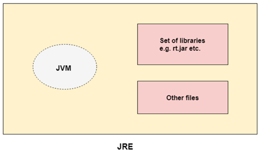

# Interview preparation on Java (OOP)

## Index
- [Interview preparation on Java (OOP)](#interview-preparation-on-java-oop)
  - [Index](#index)
  - [🚀 Topics covered from javatpoint and other sources](#-topics-covered-from-javatpoint-and-other-sources)
    - [🍂 what is java?](#-what-is-java)
    - [🍂 why java is OOP language?](#-why-java-is-oop-language)
    - [🍂 why java is a platform?](#-why-java-is-a-platform)
    - [🍂 what is package in java?](#-what-is-package-in-java)
    - [🍂 what is JVM?](#-what-is-jvm)
    - [🍂 what is JRE?](#-what-is-jre)
    - [🍂 what is JDK?](#-what-is-jdk)
    - [🍂 difference between object and class.](#-difference-between-object-and-class)
    - [🍂 difference between method overloading and overriding.](#-difference-between-method-overloading-and-overriding)
    - [🍂 types of variables.](#-types-of-variables)
    - [🍂 data types.](#-data-types)
    - [🍂 what is class?](#-what-is-class)
    - [🍂 what is inheritance?](#-what-is-inheritance)
    - [🍂 what is polymorphism?](#-what-is-polymorphism)
    - [🍂 what is abstraction?](#-what-is-abstraction)
    - [🍂 what is encapsulation?](#-what-is-encapsulation)
    - [🍂 what is a constructor?](#-what-is-a-constructor)
    - [🍂 what is private constructor?](#-what-is-private-constructor)
    - [🍂 why is java's main method static?](#-why-is-javas-main-method-static)
    - [🍂 what is this keyword?](#-what-is-this-keyword)
    - [🍂 what is super keyword?](#-what-is-super-keyword)
    - [🍂 what is final keyword?](#-what-is-final-keyword)
    - [🍂 what is static keyword?](#-what-is-static-keyword)
    - [🍂 what is strictft keyword?](#-what-is-strictft-keyword)
    - [🍂 why multiple inheritance is not supported in java?](#-why-multiple-inheritance-is-not-supported-in-java)
    - [🍂 why method overloading is not possible by changing the return type only?](#-why-method-overloading-is-not-possible-by-changing-the-return-type-only)
    - [🍂 can we overlaod java main() method?](#-can-we-overlaod-java-main-method)
    - [🍂 why can we not override static method?](#-why-can-we-not-override-static-method)
    - [🍂 what is instance initializer block?](#-what-is-instance-initializer-block)
    - [🍂 abstract classs in java.](#-abstract-classs-in-java)
    - [🍂 interface in java.](#-interface-in-java)
    - [🍂 difference between abstract class and interface.](#-difference-between-abstract-class-and-interface)
    - [🍂 access modifiers in java.](#-access-modifiers-in-java)
    - [🍂 java access modifiers with method overriding.](#-java-access-modifiers-with-method-overriding)
    - [🍂 object class in java.](#-object-class-in-java)
    - [🍂 object cloning in java.](#-object-cloning-in-java)
    - [🍂 wrapper class in java.](#-wrapper-class-in-java)
    - [🍂 call by value and call by reference.](#-call-by-value-and-call-by-reference)
    - [🍂 what is thread in java?](#-what-is-thread-in-java)
    - [🍂 benefits of using thread.](#-benefits-of-using-thread)
    - [🍂 life cycle of thread.](#-life-cycle-of-thread)
    - [🍂 how to create a thread in java?](#-how-to-create-a-thread-in-java)
    - [🍂 what is thread scheduler?](#-what-is-thread-scheduler)
    - [🍂 can we start a thread twice?](#-can-we-start-a-thread-twice)
    - [🍂 use of Thread.join()](#-use-of-threadjoin)
    - [🍂 what is main thread?](#-what-is-main-thread)
    - [🍂 what is daemon thread?](#-what-is-daemon-thread)
    - [🍂 what is thread pool?](#-what-is-thread-pool)
    - [🍂 how to perform single task using multiple thread?](#-how-to-perform-single-task-using-multiple-thread)
    - [🍂 garbage collection.](#-garbage-collection)
    - [🍂 what is synchronization?](#-what-is-synchronization)
    - [🍂 Thread safety in java](#-thread-safety-in-java)
    - [🍂 what is immutable object?](#-what-is-immutable-object)
    - [🍂 deadlock in java.](#-deadlock-in-java)
    - [🍂 inter-thread communication.](#-inter-thread-communication)
    - [🍂 what is the difference between procedural programming and OOP?](#-what-is-the-difference-between-procedural-programming-and-oop)
    - [🍂 what is exception in java and why handling it is important?](#-what-is-exception-in-java-and-why-handling-it-is-important)
    - [🍂 describe try, catch, finally block.](#-describe-try-catch-finally-block)
    - [🍂 what is the difference between throw and throws?](#-what-is-the-difference-between-throw-and-throws)
    - [🍂 what is the difference between checked and unchecked exceptions?](#-what-is-the-difference-between-checked-and-unchecked-exceptions)
    - [🍂 what is the difference between final, finally, and finalize?](#-what-is-the-difference-between-final-finally-and-finalize)
    - [🍂 why java does not have pointer?](#-why-java-does-not-have-pointer)
    - [🍂 Can an interface extend another interface?](#-can-an-interface-extend-another-interface)
    - [🍂 Can an interface have a constructor?](#-can-an-interface-have-a-constructor)
    - [🍂 Can an interface have variables?](#-can-an-interface-have-variables)
    - [🍂 Benefits of using abstraction.](#-benefits-of-using-abstraction)
    - [🍂 How implementation details is hidden in abstract class?](#-how-implementation-details-is-hidden-in-abstract-class)
    - [🍂 How is structure different from class?](#-how-is-structure-different-from-class)
    - [🍂 Define virtual function.](#-define-virtual-function)
    - [🍂 What is the difference between baseclass and superclass?](#-what-is-the-difference-between-baseclass-and-superclass)
    - [🍂 How much memory does a class occupy?](#-how-much-memory-does-a-class-occupy)
    - [🍂 Is it always necessary to create objects from class?](#-is-it-always-necessary-to-create-objects-from-class)
    - [🍂 Can we overload the destructure in a class?](#-can-we-overload-the-destructure-in-a-class)
    - [🍂 what will happen if we don't declare the main method as static?](#-what-will-happen-if-we-dont-declare-the-main-method-as-static)
    - [🍂 Explain the difference between \>\> and \>\>\>.](#-explain-the-difference-between--and-)
    - [🍂 What are the differences between sleep() and wait() method?](#-what-are-the-differences-between-sleep-and-wait-method)
    - [🍂 What are the differences between String, StringBuffer and StringBuilder?](#-what-are-the-differences-between-string-stringbuffer-and-stringbuilder)
    - [🍂 Why does the java array index start with 0?](#-why-does-the-java-array-index-start-with-0)
    - [🍂 What happens when we don't provide a constructor in a class?](#-what-happens-when-we-dont-provide-a-constructor-in-a-class)
    - [🍂 What are the differences between method and constructor?](#-what-are-the-differences-between-method-and-constructor)
    - [🍂 Differnce between error and exception.](#-differnce-between-error-and-exception)
    - [🍂 Why the outer class can not be static?](#-why-the-outer-class-can-not-be-static)
    - [🍂 What is the use of upcasting?](#-what-is-the-use-of-upcasting)
    - [🍂 What is the use of downcasting?](#-what-is-the-use-of-downcasting)
    - [🍂 Why abstract class can not have object?](#-why-abstract-class-can-not-have-object)
    - [🍂 If you have an interface and an abstract class implements the interface. Should the abstract class implement all the methods of the interface?](#-if-you-have-an-interface-and-an-abstract-class-implements-the-interface-should-the-abstract-class-implement-all-the-methods-of-the-interface)
    - [🍂 If you want to make method to override by other classes, how can you do this?](#-if-you-want-to-make-method-to-override-by-other-classes-how-can-you-do-this)
    - [🍂 What is coupling?](#-what-is-coupling)

<br><br>

## 🚀 Topics covered from javatpoint and other sources

### 🍂 what is java?
Java is a high-level, platform-independent, object-oriented programming language. It was developed by **James Gosling** at **Sun Microsystems** in 1995. It is a general-purpose programming language that is used to develop desktop, web, and mobile applications. It is based on the **WORA (Write Once Run Anywhere)** principle. It is a **class-based** and **object-oriented** language.
<br><br><br>

### 🍂 why java is OOP language?
Java is an object-oriented programming language because it follows the **object-oriented programming paradigm**.

It is based on the following principles:
1. **Encapsulation**: wrapping the data (variables) and code (methods) together as a single unit.
2. **Inheritance**: acquiring the properties and behaviors of another class.
3. **Polymorphism**: performing one task by different ways.
4. **Abstraction**: hiding the implementation details and showing only the functionality to the user.
<br><br><br>

### 🍂 why java is a platform?
Java is a platform because it has two components:
1. **Runtime Environment:**
    - **JVM (Java Virtual Machine)**: abstract machine that provides the runtime environment for Java bytecode.
    - **JRE (Java Runtime Environment)**: provides the runtime environment in which Java bytecode can be executed.
    - **JDK (Java Development Kit)**: software development kit used to develop Java applications.
2. **API (Application Programming Interface):** provides a set of classes and interfaces that can be used to develop Java applications. e.g. `java.lang`, `java.io`, `java.util`, `java.net`.
<br><br><br>

### 🍂 what is package in java?
A package is a namespace that organizes a set of related classes and interfaces. It is used to prevent naming conflicts. It can be imported using the `import` keyword. It can be created using the `package` keyword. It can be accessed using the `.` operator.

example:
```java
package mypackage;
import java.util.Scanner;

class MyClass {
    public static void main(String[] args) {
        Scanner sc = new Scanner(System.in);
    }
}
```
<br><br>

### 🍂 what is JVM?
**JVM (Java Virtual Machine)** is an abstract machine that provides the **runtime environment** in which **Java bytecode can be executed**. It enables Java programs to be run on any device or operating system that has a JVM installed. JVM is called a virtual machine because it doesn't physically exist. It is **not platform-independent**.

**Bytecode** is a highly optimized set of instructions that can be executed by the JVM. It is generated by the Java compiler and is platform-independent.
<br><br><br>

### 🍂 what is JRE?
JRE stands for **Java Runtime Environment**. It is the implementation of JVM. It **physically exists**. It contains a set of **libraries + other files** that JVM uses at runtime.


<br><br><br>

### 🍂 what is JDK?
JDK stands for **Java Development Kit**. It is a software development kit used to develop Java applications. It physically exists. It contains JRE + development tools.


<br><br><br>

### 🍂 difference between object and class.

<br><br><br>

### 🍂 difference between method overloading and overriding.

<br><br><br>

### 🍂 types of variables.
1. **Local variables**: declared inside the method.
2. **Instance variables**: declared inside the class but outside the method.
3. **Static variables**: declared with the static keyword.
<br><br><br>

### 🍂 data types.
1. **Primitive data types**: byte, short, int, long, float, double, char, boolean.
2. **Non-primitive data types**: String, Array, Class.


<br><br><br>

### 🍂 what is class?
A class is a blueprint for objects. It defines a data type that contains fields and methods. A class can be defined using the class keyword.

example:
```java
class MyClass {
    int x = 5;
    void myMethod() {
        System.out.println("Hello World");
    }
}
```
<br><br>

### 🍂 what is inheritance?
Inheritance is a mechanism in which one class acquires the properties and behaviors of another class. It represents the **IS-A relationship**.

example:
```java
class Animal {
    void eat() {
        System.out.println("eating...");
    }
}

class Dog extends Animal {
    void bark() {
        System.out.println("barking...");
    }
}
```
here, Dog is a subclass of Animal.
<br><br><br>

### 🍂 what is polymorphism?
Polymorphism is a mechanism in which one task is performed by different ways. It represents the **HAS-A relationship**.

1. **Compile-time polymorphism**: method overloading. (it is called compile-time polymorphism because the compiler knows which method to call at compile time).
2. **Run-time polymorphism**: method overriding. (it is called run-time polymorphism because the compiler doesn't know which method to call at compile time).

run-time polymorphism:
```java
class Animal {
    void sound() {
        System.out.println("Animal is making a sound");
    }
}

class Dog extends Animal {
    // overriding the sound method (run-time polymorphism)
    void sound() {
        System.out.println("Dog is barking");
    }
}
```

compile-time polymorphism:
```java
class Adder {
    static int add(int a, int b) {
        return a + b;
    }
    // method overloading (compile-time polymorphism)
    static double add(double a, double b) {
        return a + b;
    }
}
```
<br><br>

### 🍂 what is abstraction?
Abstraction is a process of hiding the implementation details and showing only the functionality to the user. It represents the **IS-A relationship**.

example:
```java
abstract class Animal {
    abstract void sound();
}

class Dog extends Animal {
    void sound() {
        System.out.println("Dog is barking");
    }
}
```
here, Dog is a subclass of Animal. Animal is an abstract class. Dog class must implement the sound method.
<br><br><br>

### 🍂 what is encapsulation?
Encapsulation is a mechanism of wrapping the data (variables) and code acting on the data (methods) together as a single unit. It represents the **HAS-A relationship**. It is achieved by declaring the class variables as private and providing public getter and setter methods to modify and view the variables.

example:
```java
class Student {
    private String name;
    public String getName() {
        return name;
    }
    public void setName(String name) {
        this.name = name;
    }
}
```


<br><br>

### 🍂 what is a constructor?
A constructor is a special type of method that is used to **initialize the object**. It is called when an **object is created**. It has the **same name** as the class and **doesn't have a return type**.

It can be of two types:
1. **Default constructor**: no-arg constructor.
2. **Parameterized constructor**: constructor with arguments.

example:
```java
class Student {
    int id;
    String name;

    // default constructor
    Student() {
        id = 1;
        name = "John";
    }

    // parameterized constructor
    Student(int i, String n) {
        id = i;
        name = n;
    }
}
```
<br><br>

### 🍂 what is private constructor?
A private constructor is a constructor that is declared with the private access modifier. It is used to **prevent the creation of objects** of the class. It is used in the **singleton design pattern**.

example:
```java
class Singleton {
    private static Singleton instance = new Singleton();
    private Singleton() {}
    public static Singleton getInstance() {
        return instance;
    }
}
```
<br><br>

### 🍂 why is java's main method static?
The main method is static because the JVM calls the main method without creating an object of the class. If it were not static, JVM would have to create an object of the class first and then call the main method which would lead to **unnecessary memory wastage**.
<br><br><br>

### 🍂 what is this keyword?
The this keyword is a reference variable that refers to the **current object**. It is used to refer to the current class instance variable. It is used to **differentiate between the instance variable and the local variable if they have the same name**.

example:
```java
class Student {
    int id;
    String name;

    Student(int id, String name) {
        this.id = id;
        this.name = name;
    }
}
```
<br><br>

### 🍂 what is super keyword?
The super keyword is used to refer to the **immediate parent class object**. It is used to call the parent class method, constructor, and variable.

1. **To call the parent class method**: super.method_name().
2. **To refer to the parent class instance variable**: super.variable_name.
3. **To invoke the parent class constructor from the child class**: super().

example:
```java
class Animal {
    String color = "white";
}

class Dog extends Animal {
    String color = "black";

    void display() {
        System.out.println(color); // prints black
        System.out.println(super.color); // prints white
    }
}
```
<br><br>

### 🍂 what is final keyword?
The final keyword is used to restrict the user. It can be used with variables, methods, and classes.

1. **Final variable**: the value of the variable cannot be changed.
2. **Final method**: the method cannot be overridden.
3. **Final class**: the class cannot be inherited.

example:
```java
final class Animal {
    final int x = 10;
    final void display() {
        System.out.println("Hello");
    }
}
```
<br><br>

### 🍂 what is static keyword?
The static keyword is used to create a class-level variable or method. It can be used with variables, methods, blocks, and nested classes. With the static keyword, the variable or method belongs to the class rather than the object. It is shared among all objects of the class.

1. **Static variable**: the value of the variable is shared among all objects of the class.
2. **Static method**: the method belongs to the class rather than the object.
3. **Static block**: used to initialize the static variables. **It is executed before the main method.**
4. **Static nested class**: a class can be made static **only if it is a nested class**. (inner class can be non-static or static, but a top-level class cannot be static)

example:
```java
class Student {
    static String college; // static variable

    static void change() { // static method
        college = "ABC";
    }

    static { // static block
        college = "XYZ"; // executed before the main method
    }

    static class Test { // static nested class
        void display() {
            System.out.println("Hello");
        }
    }
}
```
<br><br>

### 🍂 what is strictft keyword?
The strictfp keyword is used to restrict the floating-point calculations to ensure portability. It can be applied to classes, interfaces, and methods (not variables because variables are used to store the data and strictfp is not related to data storage). It is used to make the floating-point calculations consistent across different platforms.

example:
```java
strictfp class Test {
    strictfp void display() {
        // strictfp method
    }
}
```
<br><br>

### 🍂 why multiple inheritance is not supported in java?
Multiple inheritance is not supported in Java because it leads to the **diamond problem**. In the diamond problem, the compiler gets confused about which method to call from the parent classes. To avoid this problem, Java supports multiple inheritance through **interfaces**.
<br><br><br>

### 🍂 why method overloading is not possible by changing the return type only?
Method overloading is not possible by changing the return type only because the compiler cannot differentiate between the methods based on the return type. It can differentiate between the methods based on the number of arguments and the type of arguments.
<br><br><br>

### 🍂 can we overlaod java main() method?
Yes, we can overload the main method in Java. But the JVM calls the main method with a specific signature only: `public static void main(String[] args)`.
<br><br><br>

### 🍂 why can we not override static method?
We cannot override the static method because the static method belongs to the class rather than the object. It is shared among all objects of the class. **If we try to override the static method, the compiler will not give an error but it will call the method from the parent class only**.
<br><br><br>

### 🍂 what is instance initializer block?
The instance initializer block is used to initialize the instance data member. It is executed **before the constructor is invoked**. It is invoked **at the time of object creation each time**.

example:
```java
class A {
    int x;
    // instance initializer block
    {
        x = 10;
    }
}
```
<br><br>

### 🍂 abstract classs in java.
An abstract class is a class that is declared with the abstract keyword. It can have abstract methods and non-abstract methods. It cannot be instantiated **(cannot create objects of an abstract class)**. It can have constructors and static methods.

example:
```java
abstract class Animal {
    abstract void sound();
    void eat() {
        System.out.println("eating...");
    }
}
```
<br><br>

### 🍂 interface in java.
An interface is a reference type in Java. It is similar to a class. It is a collection of abstract methods **(100% abstract)**. A class implements an interface, thereby inheriting the abstract methods of the interface. All methods in an interface are **public and abstract** by default. It cannot have constructors and static methods. It is used to achieve multiple inheritance in Java. **All methods should be implemented in the class that implements the interface**.

example:
```java
interface Animal {
    void sound();
}

class Dog implements Animal {
    public void sound() {
        System.out.println("barking...");
    }
}
```
<br><br>

### 🍂 difference between abstract class and interface.

<br><br><br>

### 🍂 access modifiers in java.
There are four types of access modifiers in Java:
1. **Private**: accessible only within the class.
2. **Default**: accessible only within the package.
3. **Protected**: accessible within the package and outside the package through inheritance.
4. **Public**: accessible from anywhere.
<br><br><br>

### 🍂 java access modifiers with method overriding.
In method overriding, the access modifier of the overriding method **cannot be more restrictive** than the overridden method. It can be the same or less restrictive.

**restrictive order:** private > default > protected > public.

example:
```java
class Animal {
    protected void sound() {
        System.out.println("Animal is making a sound");
    }
}

class Dog extends Animal {
    // overriding the sound method
    public void sound() {
        System.out.println("Dog is barking");
    }
}
```
<br><br>

### 🍂 object class in java.
The Object class is the root class of Java. It is present in the `java.lang` package. It is the **superclass of all classes** in Java. It provides some methods that are common to all objects. Some of the methods are: `toString()`, `equals()`, `hashCode()`, `getClass()`, `clone()`, `finalize()`, `notify()`, `notifyAll()`, `wait()`.

example:
```java
class Student {
    int id;
    String name;

    Student(int id, String name) {
        this.id = id;
        this.name = name;
    }

    public static void main(String[] args) {
        Student s1 = new Student(1, "John");
        Student s2 = new Student(1, "John");
        System.out.println(s1.equals(s2)); // prints false (uses the equals method of the Object class)
    }
}
```
<br><br><br>

### 🍂 object cloning in java.
Object cloning is a way to create an exact copy of an object. It is achieved by implementing the `Cloneable` interface and overriding the `clone()` method of the `Object` class. It is a shallow copy. To achieve a deep copy, we need to override the `clone()` method and copy the object's fields manually.

shallow copy:
```java
class Student implements Cloneable {
    int id;
    String name;

    Student(int id, String name) {
        this.id = id;
        this.name = name;
    }

    public Object clone() throws CloneNotSupportedException {
        return super.clone();
    }
}
```

deep copy:
```java
class Student implements Cloneable {
    int id;
    String name;

    Student(int id, String name) {
        this.id = id;
        this.name = name;
    }

    @override
    public Object clone() throws CloneNotSupportedException {
        Student s = new Student(id, name);
        return s;
    }
}
```
<br><br>

### 🍂 wrapper class in java.
A wrapper class is a class that wraps the primitive data types. It provides a way to use primitive data types as objects.

example:
```java
int x = 10;
Integer y = new Integer(x); // wrapping
int z = y.intValue(); // unwrapping
```
<br><br>

### 🍂 call by value and call by reference.
In Java, arguments are passed by value. In call by value, a copy of the actual value is passed to the method. The changes made to the parameter inside the method have no effect on the actual argument. Java does not support call by reference.

call by value:
```java
class Test {
    int x = 10;

    void change(int x) {
        x = 20;
    }

    public static void main(String[] args) {
        Test t = new Test();
        t.change(t.x);
        System.out.println(t.x); // prints 10
    }
}
```
<br><br>

### 🍂 what is thread in java?
A thread is a **lightweight sub-process** that is used to execute a task. It is a separate path of execution. It is used to achieve **multitasking**. It is a part of the process. It shares the process's resources but executes independently.


<br><br><br>

### 🍂 benefits of using thread.
1. **Multitasking**: multiple tasks can be executed simultaneously.
2. **Efficient**: threads share the same memory space, so it is more efficient than processes.
3. **Responsive**: threads make the application more responsive.
<br><br><br>

### 🍂 life cycle of thread.
A thread goes through various stages in its life cycle:
1. **New**: the thread is in the new state before the start() method is called.
2. **Active**: the thread is in the active state after the start() method is called.
3. **Blocked / Waiting**: the thread is in the blocked state when it is waiting for a resource.
4. **Timed Waiting**: the thread is in the timed waiting state when it is waiting for a resource for a specific time.
5. **Terminated**: the thread is in the terminated state when it completes its execution.
<br><br><br>

### 🍂 how to create a thread in java?
There are two ways to create a thread in Java:
1. **By extending the Thread class**:
```java
class MyThread extends Thread {
    public void run() {
        System.out.println("Thread is running...");
    }

    public static void main(String[] args) {
        MyThread t = new MyThread();
        t.start(); // prints Thread is running...
    }
}
```

2. **By implementing the Runnable interface**:
```java
class MyThread implements Runnable {
    public void run() {
        System.out.println("Thread is running...");
    }

    public static void main(String[] args) {
        MyThread t = new MyThread();
        Thread thread = new Thread(t);
        thread.start(); // prints Thread is running...
    }
}
```
**Note**: the `run()` method is overridden to define the task that the thread will perform. The `start()` method is called to start the thread.
<br><br><br>

### 🍂 what is thread scheduler?
The thread scheduler is a part of the JVM that decides which thread should run. It is responsible for the execution of threads. It uses the **thread priorities** to decide which thread should run. The thread with higher priority is given preference over the thread with lower priority. The thread scheduler uses the **preemptive or time-slicing scheduling** algorithm to switch between threads.

example:
```java
Thread t1 = new Thread();
Thread t2 = new Thread();
t1.setPriority(Thread.MIN_PRIORITY); // 1
t2.setPriority(Thread.MAX_PRIORITY); // 10
```
<br><br>

### 🍂 can we start a thread twice?
No, we cannot start a thread twice. If we try to start a thread twice, it will throw a `java.lang.IllegalThreadStateException`.
<br><br><br>

### 🍂 use of Thread.join()
The `join()` method is used to **wait for a thread to complete its execution**. It makes the current thread wait until the specified thread is dead. It is used to **join the threads**.

example:
```java
class MyThread extends Thread {
    public void run() {
        for (int i = 1; i <= 5; i++) {
            System.out.println(i);
        }
    }

    public static void main(String[] args) {
        MyThread t1 = new MyThread();
        MyThread t2 = new MyThread();
        t1.start();
        try {
            t1.join();
        } catch (InterruptedException e) {
            System.out.println(e);
        }
        t2.start();
    }
}
```
here, the main thread waits for t1 to complete its execution before starting t2.
<br><br><br>

### 🍂 what is main thread?
The main thread is the thread that is created when the program starts. It is the **entry point of the program**. It is responsible for the execution of the main() method. It is a **non-daemon** thread. It is created by the JVM when the program starts.
<br><br><br>

### 🍂 what is daemon thread?
A daemon thread is a low-priority thread that **runs in the background**. It provides services to the **user threads**. It is used to perform tasks such as garbage collection, memory management, etc. It is a **daemon** thread. It is created by the JVM when the program starts. It is terminated when all the user threads finish their execution.
<br><br><br>

### 🍂 what is thread pool?
A thread pool is a collection of threads that are **reused** to execute tasks. It is used to manage the threads efficiently. It provides a way to **limit the number of threads** that can be created. It is used to improve the performance of the application. It is created using the `Executors` class.

example:
```java
import java.util.concurrent.ExecutorService;
import java.util.concurrent.Executors;

class WorkerThread implements Runnable {
    private String message;

    public WorkerThread(String s) {
        this.message = s;
    }

    public void run() {
        System.out.println(Thread.currentThread().getName() + " (Start) message = " + message);
        processMessage();
        System.out.println(Thread.currentThread().getName() + " (End)");
    }

    private void processMessage() {
        try {
            Thread.sleep(2000);
        } catch (InterruptedException e) {
            System.out.println(e);
        }
    }
}

public class ThreadPool {
    public static void main(String[] args) {
        ExecutorService executor = Executors.newFixedThreadPool(5); // thread pool with 5 threads
        for (int i = 0; i < 10; i++) {
            Runnable worker = new WorkerThread("" + i); // creating a new worker thread
            executor.execute(worker); // executing the worker thread. It will run in one of the threads in the thread pool.
        }
        executor.shutdown(); // shut down the thread pool. It will wait for all the threads to finish their execution.
        while (!executor.isTerminated()) {}
        System.out.println("Finished all threads");
    }
}
```
output:
```
pool-1-thread-1 (Start) message = 0
pool-1-thread-2 (Start) message = 1
pool-1-thread-3 (Start) message = 2
pool-1-thread-4 (Start) message = 3
pool-1-thread-5 (Start) message = 4
pool-1-thread-1 (End)
pool-1-thread-2 (End)
pool-1-thread-3 (End)
pool-1-thread-4 (End)
pool-1-thread-5 (End)
pool-1-thread-1 (Start) message = 5
pool-1-thread-2 (Start) message = 6
pool-1-thread-3 (Start) message = 7
pool-1-thread-4 (Start) message = 8
pool-1-thread-5 (Start) message = 9
pool-1-thread-1 (End)
pool-1-thread-2 (End)
pool-1-thread-3 (End)
pool-1-thread-4 (End)
pool-1-thread-5 (End)
Finished all threads
```
here, the thread pool is created with 5 threads. The `WorkerThread` class is used to define the task that the thread will perform. The `execute()` method is used to execute the task. The `shutdown()` method is used to shut down the thread pool. The `WorkerThread` class implements the `Runnable` interface.
<br><br><br>

### 🍂 how to perform single task using multiple thread?
Using single runnable object, we can perform a single task using multiple threads. The `run()` method of the `Runnable` interface is overridden to define the task that the thread will perform.

example:
```java
class MyThread implements Runnable {
    public void run() {
        System.out.println("Thread is running...");
    }

    public static void main(String[] args) {
        MyThread t = new MyThread();
        Thread t1 = new Thread(t);
        Thread t2 = new Thread(t);
        t1.start(); // prints Thread is running...
        t2.start(); // prints Thread is running...
    }
}
```
<br><br>

### 🍂 garbage collection.
Garbage collection is a process of reclaiming the unused memory. It is **performed automatically by the JVM**. It is used to free up the memory occupied by the objects that are no longer in use. It is a part of the memory management system. It is used to prevent memory leaks and improve the performance of the application.
<br><br><br>

### 🍂 what is synchronization?
Synchronization is a process of controlling the access of multiple threads to shared resources. It is used to avoid data inconsistency. It is achieved using the `synchronized` keyword.

example:
```java
// this class is used to print the table of a number
class Table {
    synchronized void printTable(int n) {
        for (int i = 1; i <= 5; i++) {
            System.out.println(n * i);
            try {
                Thread.sleep(400);
            } catch (InterruptedException e) {
                System.out.println(e);
            }
        }
    }
}

// this class is used to create a thread that prints the table of 5
class MyThread1 extends Thread {
    Table t;
    MyThread1(Table t) {
        this.t = t;
    }
    public void run() {
        t.printTable(5);
    }
}

// this class is used to create a thread that prints the table of 100
class MyThread2 extends Thread {
    Table t;
    MyThread2(Table t) {
        this.t = t;
    }
    public void run() {
        t.printTable(100);
    }
}

// this class is used to create the table object and start the threads
public class Synchronization {
    public static void main(String[] args) {
        Table obj = new Table();
        MyThread1 t1 = new MyThread1(obj);
        MyThread2 t2 = new MyThread2(obj);
        t1.start();
        t2.start();
    }
}
```
output:
```
5
10
15
20
25
100
200
300
400
500
```
here, the `printTable()` method is synchronized. The `MyThread1` and `MyThread2` classes are used to create threads that print the table of 5 and 100 respectively. The `synchronized` keyword is used to synchronize the `printTable()` method.
<br><br><br>

### 🍂 Thread safety in java
Thread safety is a property of an object that guarantees that **it is safe to be used by multiple threads at the same time**. It is achieved by using synchronization. It is used to prevent data inconsistency.

We can achieve thread safety in Java using the following methods:
1. **Synchronization**: using the `synchronized` keyword.
2. **Immutable objects**: objects that cannot be modified.
3. **Volatile keyword**: used to prevent thread caching.
4. **Atomic classes**: classes that provide atomic operations.
5. **ThreadLocal class**: used to create thread-local variables.
6. **Concurrent collection classes**: classes that provide thread-safe operations.
7. **Lock interface**: used to provide a fine-grained control over the synchronization.
8. **Semaphore class**: used to control the number of threads that can access a resource.

example:
```java
class Table {
    synchronized void printTable(int n) {
        for (int i = 1; i <= 5; i++) {
            System.out.println(n * i);
            try {
                Thread.sleep(400);
            } catch (InterruptedException e) {
                System.out.println(e);
            }
        }
    }
}
```

<br><br>

### 🍂 what is immutable object?
An immutable object is an object whose state cannot be changed after it is created. It is used to achieve thread safety. It is used to prevent data inconsistency. It is achieved by making the class final and the fields private and providing only getter methods.

example:
```java
final class Student {
    private final int id;
    private final String name;

    Student(int id, String name) {
        this.id = id;
        this.name = name;
    }

    public int getId() {
        return id;
    }

    public String getName() {
        return name;
    }
}
```

<br><br>

### 🍂 deadlock in java.
Deadlock is a situation in which two or more threads are waiting for each other to release the resources. It is a common problem in multi-threading. It can occur when two threads have a circular dependency on a pair of synchronized objects.

example:
```java
class A {
    synchronized void foo(B b) {
        String name = Thread.currentThread().getName();
        System.out.println(name + " entered A.foo");
        try {
            Thread.sleep(1000);
        } catch (InterruptedException e) {
            System.out.println("A interrupted");
        }
        System.out.println(name + " trying to call B.last()");
        b.last();
    }

    synchronized void last() {
        System.out.println("Inside A.last");
    }
}

class B {
    synchronized void bar(A a) {
        String name = Thread.currentThread().getName();
        System.out.println(name + " entered B.bar");
        try {
            Thread.sleep(1000);
        } catch (InterruptedException e) {
            System.out.println("B interrupted");
        }
        System.out.println(name + " trying to call A.last()");
        a.last();
    }

    synchronized void last() {
        System.out.println("Inside B.last");
    }
}

class Deadlock implements Runnable {
    A a = new A();
    B b = new B();

    Deadlock() {
        Thread.currentThread().setName("MainThread");
        Thread t = new Thread(this, "RacingThread");
        t.start();
        a.foo(b);
        System.out.println("Back in main thread");
    }

    public void run() {
        b.bar(a);
        System.out.println("Back in other thread");
    }

    public static void main(String[] args) {
        new Deadlock();
    }
}
```
output:
```
MainThread entered A.foo
RacingThread entered B.bar
MainThread trying to call B.last()
RacingThread trying to call A.last()
```
here, the `foo()` method of class `A` is synchronized and the `bar()` method of class `B` is synchronized. The `Deadlock` class creates two threads that call the `foo()` and `bar()` methods. The `foo()` method calls the `last()` method of class `B` and the `bar()` method calls the `last()` method of class `A`. This creates a circular dependency and leads to a deadlock.
<br><br><br>

### 🍂 inter-thread communication.
Inter-thread communication is a process of communication between two or more threads. It is used to achieve synchronization between threads.

It is achieved using the following methods:
1. **wait()**: causes the current thread to wait until another thread invokes the `notify()` or `notifyAll()` method.
2. **notify()**: wakes up a single thread that is waiting on the object.
3. **notifyAll()**: wakes up all the threads that are waiting on the object.

<br><br>

### 🍂 what is the difference between procedural programming and OOP?
Procedural programming is a top-down approach to programming, where the program is divided into a series of functions that each perform a specific task. OOP, on the other hand, is a bottom-up approach to programming, where the program is divided into a series of objects that each represent a real-world entity.

The main differences between procedural programming and OOP are:
| Procedural Programming | Object-Oriented Programming |
|-------------------------|------------------------------|
| In procedural programming, the program is divided into small parts called functions. | In object-oriented programming, the program is divided into small parts called objects. |
| Procedural programming follows a top-down approach. | 	Object-oriented programming follows a bottom-up approach. |
| There is no access specifier in procedural programming. | 	Object-oriented programming has access specifiers like private, public, protected, etc.|
| Adding new data and functions is not easy. | 	Adding new data and function is easy. |
| Procedural programming does not have any proper way of hiding data so it is less secure. | 	Object-oriented programming provides data hiding so it is more secure. |
| In procedural programming, overloading is not possible. |  	Overloading is possible in object-oriented programming. |
| In procedural programming, there is no concept of data hiding and inheritance. | 	In object-oriented programming, the concept of data hiding and inheritance is used. |
| In procedural programming, the function is more important than the data. | 	In object-oriented programming, data is more important than function
| Procedural programming is based on the unreal world. | 	Object-oriented programming is based on the real world. |
| Procedural programming is used for designing medium-sized programs. | 	Object-oriented programming is used for designing large and complex programs
| Procedural programming uses the concept of procedure abstraction. | 	Object-oriented programming uses the concept of data abstraction. |
| Code reusability absent in procedural programming. | 	Code reusability present in object-oriented programming. |
| Examples: C, FORTRAN, Pascal, Basic, etc. | 	Examples: C++, Java, Python, C#, etc. |

<br><br>

### 🍂 what is exception in java and why handling it is important?
An exception is an event that occurs during the execution of a program that disrupts the normal flow of instructions.

Exception handling is important because:
1. **Prevents the program from crashing**: if an exception is not handled, the program will crash.
2. **Improves the readability of the code**: by separating the error-handling code from the normal code.
3. **Maintains the flow of the program**: by handling exceptions gracefully.
4. **Provides a way to recover from errors**: by catching and handling exceptions.
5. **Helps in debugging**: by providing information about the error.
6. **Prevents security vulnerabilities**: by handling exceptions securely.
7. **Improves the user experience**: by providing meaningful error messages.
<br><br><br>

### 🍂 describe try, catch, finally block.
- **try block**: contains the code that may throw an exception. It is followed by one or more catch blocks.
- **catch block**: catches the exception thrown by the try block. It contains the code to handle the exception.
- **finally block**: contains the code that is always executed, whether an exception is thrown or not. It is used to release resources, close connections, etc.
<br><br><br>

### 🍂 what is the difference between throw and throws?
The `throw` keyword is used to **throw an exception** explicitly. It is used to create a new exception and throw it. It is used inside the method body.
```java
void function() {
    throw new Exception("Exception message");
}
```
<br>

The `throws` keyword is used to **declare an exception**. It is used to declare that a method may throw an exception. It is used in the method signature.
```java
void function() throws Exception {
    // code that may throw an exception
}
```
<br><br>

### 🍂 what is the difference between checked and unchecked exceptions?
- **Checked exceptions** are the exceptions that are checked at compile time. They are the exceptions that are checked by the compiler to ensure that they are caught or declared to be thrown. They are subclasses of `Exception` but not subclasses of `RuntimeException`. Examples: `IOException`, `SQLException`.
- **Unchecked exceptions** are the exceptions that are not checked at compile time. They are the exceptions that are not checked by the compiler. They are subclasses of `RuntimeException`. Examples: `ArithmeticException`, `NullPointerException`.
<br><br><br>

### 🍂 what is the difference between final, finally, and finalize?
- **final**: is a keyword that is used to **restrict the user**. It can be used with variables, methods, and classes. It is used to make the variable constant, the method cannot be overridden, and the class cannot be inherited.
```java
final int x = 10;
final void display() {
    // code
}
final class Animal {
    // code
}
```
<br>

- **finally**: is a block that is used to execute the **important code** such as closing the connection, releasing resources, etc. It is always executed whether an exception is thrown or not.
```java
try {
    // code that may throw an exception
} catch (Exception e) {
    // exception handling code
} finally {
    // code that is always executed
}
```
<br>

- **finalize**: is a method that is called by the **garbage collector** before the object is destroyed. It is used to perform cleanup operations such as closing the connection, releasing resources, etc.
```java
protected void finalize() {
    // cleanup code
}
```

<br><br>

### 🍂 why java does not have pointer?
Java does not have pointers because pointers are **unsafe** and **unsecure**. They can be used to access memory locations directly, leading to memory corruption and security vulnerabilities. Java uses **references** instead of pointers. References are **safer** and **more secure** than pointers. They provide a level of **abstraction** that prevents direct access to memory locations.

<br><br>

### 🍂 Can an interface extend another interface?
Yes, an interface can extend another interface. It is called **interface inheritance**. An interface can extend multiple interfaces. It is used to achieve **multiple inheritance** in Java.

example:
```java
interface A {
    void display();
}

interface B extends A {
    void show();
}
```

<br><br>

### 🍂 Can an interface have a constructor?
No, an interface cannot have a constructor. An interface is a **blueprint** for a class and does not have any **implementation**. It cannot be instantiated, so it does not have a constructor.

<br><br>

### 🍂 Can an interface have variables?
Yes, an interface can have variables. The variables in an interface are **implicitly** public, static, and final. They are **constants** and cannot be changed.

example:
```java
interface A {
    int x = 10; // implicitly public, static, and final
}
```

<br><br>

### 🍂 Benefits of using abstraction.
1. **Security**: it hides the implementation details and provides security.
2. **Flexibility**: it allows the implementation to change without affecting the user.
3. **Code reusability**: it allows the code to be reused in different classes.
4. **Maintenance**: it makes the code easier to maintain and update.
5. **Encapsulation**: it is closely related to encapsulation and data hiding.
6. **Big projects**: it is useful in big projects where multiple developers are working on the same project.

<br><br>

### 🍂 How implementation details is hidden in abstract class?
In an abstract class, the implementation details are hidden by providing **abstract methods**. Abstract methods do not have a body and must be implemented by the subclass. The abstract class provides a **blueprint** for the subclass to follow. It defines the **structure** of the class without providing the **implementation**. The subclass is responsible for providing the implementation of the abstract methods. This allows the implementation details to be hidden from the user.

<br><br>

### 🍂 How is structure different from class?
A structure is a **user-defined data type** that is used to group related data items of different data types. It is similar to a class in Java but does not have methods. It is not possible to instantiate a structure or inherit from a structure. It is used to represent a simple data structure.

example:
```java
struct Student {
    int id;
    String name;
};
```

<br><br>

### 🍂 Define virtual function.
A virtual function is a function that is declared in a base class and is **redefined** in a derived class. It is used to achieve **runtime polymorphism**. It allows the function to be called based on the type of object rather than the type of the pointer.

example:
```java
class Animal {
    void sound() {
        System.out.println("Animal is making a sound");
    }
}

class Dog extends Animal {
    void sound() {
        System.out.println("Dog is barking");
    }
}
```
here, the `sound()` method is a virtual function.

<br><br>

### 🍂 What is the difference between baseclass and superclass?
The baseclass is the **root class** in a class hierarchy. It is the class from which other classes are derived. The superclass is the **immediate parent class** of a class. It is the class that is extended by another class.

<br><br>

### 🍂 How much memory does a class occupy?
Classes do not occupy memory. Objects of the class occupy memory. The memory occupied by an object of a class depends on the **instance variables** of the class.

<br><br>

### 🍂 Is it always necessary to create objects from class?
No, it is not always necessary to create objects from a class. Some classes have **static methods** that can be called without creating an object of the class. These methods are called **class methods**.

<br><br>

### 🍂 Can we overload the destructure in a class?
No, we cannot overload the destructor in a class. The destructor is called automatically when an object is destroyed. It does not have a return type and cannot be overloaded.

example:
```java
class A {
    ~A() {
        // destructor code
    }
}
```

<br><br>

### 🍂 what will happen if we don't declare the main method as static?
We can declare the main method without the static keyword, but the program will not run. The main method is the entry point of the program, and it must be declared as static so that the JVM can call it without creating an object of the class. Though the program will compile successfully, it will throw a `NoSuchMethodError` at runtime.

<br><br>

### 🍂 Explain the difference between >> and >>>.
The `>>` operator is the **signed right shift operator**. It shifts the bits to the right by the specified number of positions and fills the leftmost positions with the sign bit **(0 for positive numbers and 1 for negative numbers).**

The `>>>` operator is the **unsigned right shift operator**. It shifts the bits to the right by the specified number of positions and fills the **leftmost positions with zeros.**

example:
```java
int x = -8;
System.out.println(x >> 1); // prints -4
System.out.println(x >>> 1); // prints 2147483644
```
binary representation of -8: `11111111111111111111111111111000`

`>>` operator: `11111111111111111111111111111100` (-4) <br>
`>>>` operator: `0111111111111111111111111111100` (2147483644)

<br><br>

### 🍂 What are the differences between sleep() and wait() method?
| Feature | `sleep()` | `wait()` |
|---------|-----------|----------|
| **Belongs to** | `Thread` class | `Object` class |
| **Lock Release** | Does not release the lock that the current thread holds | Releases the lock which allows other threads to acquire it |
| **Method Type** | Static method | Non-static method |
| **InterruptedException** | Does not throw an `InterruptedException` | Throws `InterruptedException` if the thread is interrupted while waiting |
| **Purpose** | Mainly used to delay a thread for a specific time duration | Mainly used to pause a thread until notified by another thread |
| **Overloaded Methods** | `sleep(long millis)`<br>`sleep(long millis, int nanos)`<br>**Parameters:**<br>`millis`: milliseconds<br>`nanos`: nanoseconds | `wait()`<br>`wait(long timeout)`<br>`wait(long timeout, int nanos)`<br>**Parameters:**<br>`timeout`: milliseconds<br>`nanos`: nanoseconds |

<br><br>

### 🍂 What are the differences between String, StringBuffer and StringBuilder?
| Feature | `String` | `StringBuffer` | `StringBuilder` |
|---------|----------|---------------|-----------------|
| **Mutability** | Immutable | Mutable | Mutable |
| **Thread Safety** | Thread-safe | Thread-safe | Not thread-safe |
| **Performance** | Slow | Fast | Faster |
| **Synchronization** | Synchronized | Synchronized | Not synchronized |
| **Memory Usage** | More memory | Less memory | Less memory |
| **Methods** | Fewer methods | More methods | More methods |
| **Use Case** | When the content is fixed | When the content is modified frequently | When the content is modified frequently |

<br><br>

### 🍂 Why does the java array index start with 0?
The index of an array signifies the distance from the start of the array. So, the first element of the array is at index 0 because it is 0 units away from the start of the array. This convention is followed in many programming languages, including Java.

<br><br>

### 🍂 What happens when we don't provide a constructor in a class?
If we don't provide a constructor in a class, the compiler automatically provides a **default constructor**. The default constructor is a no-argument constructor that initializes the instance variables to their default values. If a class does not have any constructor, the default constructor is provided by the compiler.

<br><br>

### 🍂 What are the differences between method and constructor?
| Feature | Method | Constructor |
|---------|--------|-------------|
| **Return Type** | Can have a return type | Does not have a return type |
| **Name** | Can have any name | Must have the same name as the class |
| **Inheritance** | Inherited by subclasses | Not inherited by subclasses |
| **Static** | Can be static or non-static | Cannot be static |
| **Purpose** | Used to perform a specific task | Used to initialize the object of the class |

<br><br>

### 🍂 Differnce between error and exception.
| Feature | Error | Exception |
|---------|-------|-----------|
| **Cause** | Caused by the environment in which the application is running | Caused by the application itself |
| **Handling** | Cannot be caught or handled | Can be caught and handled |
| **Recovery** | Cannot be recovered from | Can be recovered from |
| **Examples** | `OutOfMemoryError`, `StackOverflowError` | `ArithmeticException`, `NullPointerException` |

<br><br>

### 🍂 Why the outer class can not be static?
The outer class cannot be static because the **static keyword is used to define a class-level variable or method**. The outer class is a top-level class and does not belong to any other class. It is not associated with any instance of the class, so it cannot be declared as static.

<br><br>

### 🍂 What is the use of upcasting?
Upcasting is used to **treat an object of a subclass as an object of its superclass**. It is used to achieve **polymorphism**. It allows the superclass reference variable to refer to the subclass object. It is used to achieve **dynamic method dispatch**.

example:
```java
class Animal {
    int x = 10;
    void sound() {
        System.out.println("Animal is making a sound");
    }
}

class Dog extends Animal {
    int x = 20;
    void sound() {
        System.out.println("Dog is barking");
    }
}

public class Upcasting {
    public static void main(String[] args) {
        Animal a = new Dog(); // upcasting
        a.sound(); // prints Dog is barking

        System.out.println(a.x); // prints 10
    }
}
```

<br><br>

### 🍂 What is the use of downcasting?
Downcasting is used to **treat an object of a superclass as an object of its subclass**. It is used to access the methods and fields of the subclass. It is used to achieve **dynamic method dispatch**. (Downcasting is needed in object-oriented programming to access the specific methods and properties of a subclass that are not available in a superclass reference.)

example:
```java
class Animal {
    void makeSound() {
        System.out.println("Some sound");
    }
}

class Dog extends Animal {
    void makeSound() {
        System.out.println("Bark");
    }

    void fetch() {
        System.out.println("Fetching");
    }
}

public class Main {
    public static void main(String[] args) {
        Animal myAnimal = new Dog(); // Upcasting
        myAnimal.makeSound(); // This will call the Dog's makeSound method
        // myAnimal.fetch(); // This will give an error, because the Animal class doesn't have a fetch method

        // We need to call the fetch method, which is specific to Dog
        if (myAnimal instanceof Dog) {
            Dog myDog = (Dog) myAnimal; // Downcasting
            myDog.fetch(); // Now we can call the fetch method
        }
    }
}
```

<br><br>

### 🍂 Why abstract class can not have object?
An abstract class cannot have an object because it is an **incomplete class**. It is used to provide a **blueprint** for other classes to follow. It cannot be instantiated because it may contain **abstract methods** that do not have a body. It is used to achieve **abstraction** and **inheritance**.

<br><br>

### 🍂 If you have an interface and an abstract class implements the interface. Should the abstract class implement all the methods of the interface?
If an abstract class implements an interface, it is not necessary for the abstract class to implement all the methods of the interface. The abstract class can provide **partial implementation** of the interface methods and leave the rest to be implemented by the subclass.

```java
interface Animal {
    void sound();
    void eat();
}

abstract class Dog implements Animal {
    // eat() method is not implemented. It will be implemented by the subclass
    void sound() {
        System.out.println("Dog is barking");
    }
}

class Labrador extends Dog {
    // sound() method is implemented by the abstract class
    void eat() {
        System.out.println("Labrador is eating");
    }
}
```

<br><br>

### 🍂 If you want to make method to override by other classes, how can you do this?
To make a method overrideable by other classes, I can declare the method as **abstract** in the superclass. An abstract method does not have a body and must be implemented by the subclass. It is used to achieve **abstraction** and **polymorphism**.

```java
abstract class Animal {
    abstract void sound(); // to be implemented by the subclass
}

class Dog extends Animal {
    void sound() {
        System.out.println("Dog is barking");
    }
}
```

<br><br>

### 🍂 What is coupling?
The degree of dependency components is called coupling.

Types of coupling:
1. **Tight coupling**: when a class is dependent on another class. (dependency is high. not good)
2. **Loose coupling**: when a class is not dependent on another class. (dependency is low. good)

<br><br>

<hr>