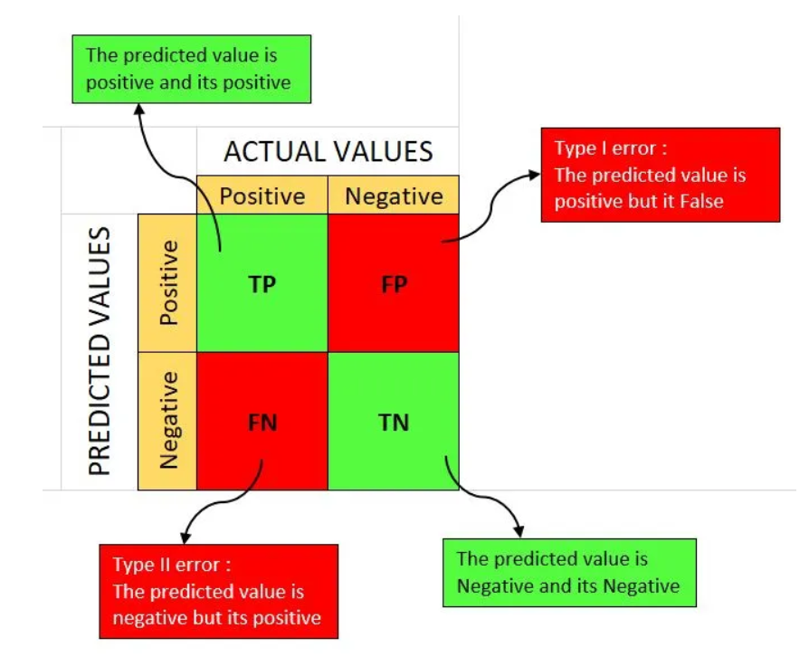

# Interview Preparation on Machine Learning

## Index

## 🚀 Topics covered from miscellaneous sources

### 🍂 What is Artificial Intelligence?
Artificial intelligence (AI) is the **simulation of human intelligence processes by machines**, especially computer systems. These processes include learning (the acquisition of information and rules for using the information), reasoning (using rules to reach approximate or definite conclusions) and self-correction.

  

### 🍂 What is Machine Learning?
Machine learning is a subset of artificial intelligence in the field of computer science that often uses statistical techniques to give computers the ability to "learn" with data, without being explicitly programmed.

  

### 🍂 What is Deep Learning?
Deep learning is a subset of machine learning in artificial intelligence (AI) that has **networks capable of learning unsupervised from data that is unstructured or unlabeled**. Also known as deep neural learning or deep neural network.

  

### 🍂 What is Confusion Matrix?
A confusion matrix is a table that is often used to describe the performance of a **classification model (or "classifier")** on a set of data for which the true values are known. It allows the visualization of the performance of an algorithm.

  

### 🍂 What are evaluation metrices?
Evaluation metrics are used to measure the quality of the statistical or machine learning model. Evaluating machine learning models or algorithms is essential for any project. There are several different evaluation metrics available to test a model. These include:
- Accuracy
- Precision
- Recall
- F1 Score
- False Positive Rate
- Specificity
- AUC-ROC Curve

  

#### 🍃 What is Accuracy?
Accuracy is the ratio of correctly predicted observation to the total observations. It is the most intuitive performance measure.

`Accuracy = (TP + TN) / (TP + TN + FP + FN)`

  

#### 🍃 What is Precision?
Precision is the ratio of correctly predicted positive observations to the total predicted positive observations.

`Precision = TP / (TP + FP)`

  

#### 🍃 What is Recall (Sensitivity/ True Positive Rate)?
Recall is the ratio of correctly predicted positive observations to the all observations in actual class.

`Recall = TP / (TP + FN)`

  

#### 🍃 What is F1 Score?
F1 Score is the weighted average of Precision and Recall. Therefore, this score takes both false positives and false negatives into account.

`F1 Score = 2 * (Precision * Recall) / (Precision + Recall)`

  

#### 🍃 What is False Positive Rate?
False Positive Rate is the ratio of incorrectly predicted positive observations to the total negative observations.

`FPR = FP / (FP + TN)`  
`FPR = 1 - Specificity`

  

#### 🍃 What is Specificity (True Negative Rate)?
Specificity is the ratio of correctly predicted negative observations to the all observations in actual class. It is opposite of Recall.

`Specificity = TN / (TN + FP)`

  

#### 🍃 What is AUC-ROC Curve?
A **receiver operating characteristic curve, or ROC curve**, is a graphical plot that illustrates the **diagnostic ability** of a binary classifier system as its discrimination threshold is varied.

The ROC curve is created by plotting the true positive rate (TPR) against the false positive rate (FPR) at various threshold settings. Threshold setting is a value that is used to classify the predicted probabilities into classes. Here the threshold value is varied from 0 to 1, which will give different FPR and TPR values. The area under the ROC curve (AUC) is a measure of how well a parameter can distinguish between two diagnostic groups (diseased/normal). The AUC (Area Under the Curve) makes it easy to compare the ROC curve with one another.
[Tutorial on ROC and AUC](https://www.youtube.com/watch?v=4jRBRDbJemM)

  

### 🍂 Types of Machine Learning?
There are three types of machine learning:
1. **Supervised Learning**: Supervised learning is the types of machine learning in which machines are trained using well "labelled" training data, and on basis of that data, machines predict the output. The labelled data means some input data is already tagged with the correct output.
2. **Unsupervised Learning**: Unsupervised learning is the training of machine using information that is neither classified nor labelled and allowing the algorithm to act on that information without guidance. Here the task of machine is to group unsorted information according to similarities, patterns and differences without any prior training of data. (use: clustering, association, dimensionality reduction)
3. **Reinforcement Learning**: Reinforcement learning is an area of machine learning concerned with how software agents ought to take actions in an environment in order to maximize the notion of cumulative reward. Reinforcement learning is one of three basic machine learning paradigms, alongside supervised learning and unsupervised learning. (use: gaming, robotics, navigation)

  

### 🍂 What is Linear Regression?
Linear regression is a linear approach to modeling the relationship between a scalar response (or dependent variable) and one or more explanatory variables (or independent variables). (Simply, it is a method to predict the value of a dependent variable based on the value of an independent variable.)

  

### 🍂 What is Logistic Regression?
Logistic regression aims to **solve classification problems**. It does this by predicting categorical outcomes, unlike linear regression that predicts a continuous outcome.

In the simplest case there are two outcomes, which is called binomial, an example of which is predicting if a tumor is malignant or benign. Other cases have more than two outcomes to classify, in this case it is called multinomial. A common example for multinomial logistic regression would be predicting the class of an iris flower between 3 different species.

  

### 🍂 What is Gradient Descent?
Gradient Descent is an optimization algorithm used for minimizing the cost function in various machine learning algorithms. It is used to update the parameters of the model. The goal of the algorithm is to find the minimum of a function.

`temp_w = w - α * ∂J(w, b) / ∂w`  
`temp_b = b - α * ∂J(w, b) / ∂b`  
`w = temp_w`  
`b = temp_b`

This is repeated until the cost function converges to a minimum value or a certain number of iterations are reached. Here, temp variables are used to prevent the update of the weights and biases at the same time. This is because the weights and biases are dependent on each other.

where:
- `w` is the weight
- `b` is the bias
- `α` is the learning rate
- `J(w, b)` is the cost function
- `∂J(w, b) / ∂w` is the derivative of the cost function with respect to the weight
- `∂J(w, b) / ∂b` is the derivative of the cost function with respect to the bias

  

### 🍂 When to use logistic regression and other classification algorithms?
- **Logistic Regression**: When the dependent variable is binary. (e.g. 0 or 1, Yes or No, True or False)
- **K-Nearest Neighbors (KNN)**: When the dataset is small and speed is a priority.
- **Support Vector Machine (SVM)**: When the dataset is small and speed is not a priority.
- **Naive Bayes**: When the dataset is small and speed is a priority.

  

### 🍂 Cost function.
A cost function is a measure of how wrong the model is in terms of its ability to estimate the relationship between X and y. The cost function is a function that measures the performance of a machine learning algorithm for given data. Cost Function quantifies the error between predicted values and expected values and presents it in the form of a single real number.

`Model: h(x) = w * x + b`  
`Cost function: J(w, b) = 1/2m * Σ (h(x) - y)^2`

where:
- `w` is the weight
- `b` is the bias
- `x` is the input
- `m` is the number of training examples
- `h(x)` is the predicted value
- `y` is the actual value
- `Σ` is the sum over all training examples
- `1/2` is used to make the calculation easier

  

### 🍂 How 1/2 makes the calculation of cost function easier?
The 1/2 is used to make the calculation of the cost function easier. The reason is that when we take the derivative of the cost function, the 1/2 will cancel out the 2 in the power of the exponent. This will make the calculation of the derivative easier. The derivative of the cost function is used to update the weights of the model.

  

### 🍂 Why does the cost function has a square?
The cost function has a square because it is used to **penalize the model for making large errors**. The square of the error is used to **make the error positive and to make the calculation of the derivative easier**. The derivative of the cost function is used to update the weights of the model.

  

### 🍂 Why squared cost function is not used in logistic regression?
The squared cost function is not used in logistic regression because it is **non-convex**. The non-convex cost function has **multiple local minima** and the gradient descent algorithm may not converge to the global minimum. Instead, the logistic regression uses the **log loss function** which is convex and has a global minimum.

  

### 🍂 What is Overfitting and Underfitting?
**Overfitting** occurs when a model learns the detail and noise in the training data to the extent that it performs poorly on new data. This usually happens when the model is too complex.

**Underfitting** occurs when a model is too simple to learn the underlying structure of the data. This usually happens when the model is too simple.

**bias** is the difference between the average prediction of our model and the correct value which we are trying to predict.  
**Variance** is the variability of model prediction for a given data point or a value which tells us spread of our data.

  

### 🍂 Regularization.
Regularization is a technique used to prevent overfitting in machine learning models. It adds a penalty term to the cost function to **discourage the weights from becoming too large**. There are two types of regularization:
- **L1 Regularization (Lasso)**: L1 regularization adds a penalty term to the cost function that is proportional to the absolute value of the weights. It is used to **perform feature selection**. (use: L1 regularization is used when we have a large number of features and we want to perform feature selection).
- **L2 Regularization (Ridge)**: L2 regularization adds a penalty term to the cost function that is proportional to the square of the weights. It is used to **prevent overfitting**. (use: L2 regularization is used when we want to prevent overfitting).

`Cost function with L1 regularization: J(w, b) = 1/2m * Σ (h(x) - y)^2 + λ * Σ |w|`  
`Cost function with L2 regularization: J(w, b) = 1/2m * Σ (h(x) - y)^2 + λ * Σ w^2`

where:
- `λ` is the regularization parameter
- `|w|` is the absolute value of the weight
- `w^2` is the square of the weight
- `Σ` is the sum over all weights

  

### 🍂 Boosting.
Boosting is an ensemble technique that attempts to **create a strong classifier from a number of weak classifiers**. This is done by building a model from the training data, then creating a second model that attempts to correct the errors from the first model. Models are added until the training set is predicted perfectly or a maximum number of models are added.

  

### 🍂 Bagging.
Bagging is an ensemble technique that attempts to **create multiple models from a single training dataset**. This is done by creating bootstrap samples of the training data and training a model on each sample. The final prediction is made by averaging the predictions of all the models.

  

### 🍂 What is Holdout method?
The holdout method is a technique used for **evaluating the performance of a machine learning model**. It involves splitting the dataset into two sets: a training set and a test set. The training set is used to train the model, while the test set is used to evaluate the performance of the model.

  

### 🍂 What is the difference between a generative and discriminative model?
- **Generative model**: A generative model learns the joint probability distribution `P(X, Y)` and then predicts the conditional probability `P(Y|X)`. It is used to generate new data. Examples of generative models include naive Bayes, hidden Markov models, and restricted Boltzmann machines. (generates new data based on the training data)
- **Discriminative model**: A discriminative model learns the conditional probability `P(Y|X)` directly from the data. It is used to predict the label of a given input data. Examples of discriminative models include logistic regression, support vector machines, and neural networks. (predicts the label of a given input data)

  

### 🍂 What is Neural Network?
A neural network is a series of algorithms that **attempts to recognize underlying relationships in a set of data through a process that mimics the way the human brain operates**. Neural networks can adapt to changing input; so the network generates the best possible result without needing to redesign the output criteria.

  

### 🍂 Parameters that the Neural Network learns during training.
During training, the neural network learns the following parameters:
- **Weights**: The weights are the parameters that the neural network learns during training. They are used to multiply the input values to the neurons. The weights are updated during training using the backpropagation algorithm. They represent the strength of the connection between neurons.
- **Biases**: The biases are the parameters that the neural network learns during training. They are used to shift the output of the neurons. The biases are updated during training using the backpropagation algorithm. They represent the threshold of the neuron.

  

### 🍂 What is Backpropagation?
Backpropagation is a supervised learning algorithm used to train neural networks. It is a method for calculating the gradient of the loss function with respect to the weights of the network. The gradient is then used to update the weights of the network in the direction that reduces the loss.

The backpropagation algorithm consists of two main steps:
1. **Forward Pass**: The forward pass is used to calculate the output of the neural network given an input. The output is then compared to the actual output to calculate the loss.
2. **Backward Pass**: The backward pass is used to calculate the gradient of the loss function with respect to the weights of the network. The gradient is then used to update the weights of the network using an optimization algorithm such as gradient descent.

  

### 🍂 Layers in Neural Network.
A neural network consists of the following layers:
- **Input Layer**: The input layer is the first layer of the neural network. It consists of the input neurons that receive the input data.
- **Hidden Layers**: The hidden layers are the layers between the input and output layers. They consist of hidden neurons that perform computations on the input data.
- **Output Layer**: The output layer is the last layer of the neural network. It consists of the output neurons that produce the output of the network.

  

### 🍂 Activation Functions.
An activation function is a mathematical function that is used to introduce non-linearity into the output of a neuron. This non-linearity is important because it allows the neural network to learn complex patterns in the data.

 

 

- **Sigmoid**: The sigmoid function is a mathematical function that maps any real value to a value between 0 and 1. It is used in the output layer of a binary classification problem.
- **Tanh**: The tanh function is a mathematical function that maps any real value to a value between -1 and 1. It is used in the hidden layers of a neural network.
- **ReLU**: The ReLU function is a mathematical function that maps any real value to the value itself if it is positive, and 0 otherwise. It is used in the hidden layers of a neural network. It is the most popular activation function. (use: ReLU is used when we want to introduce non-linearity into the output of a neuron) (advantages: ReLU is computationally efficient and does not suffer from the vanishing gradient problem) (disadvantages: ReLU suffers from the dying ReLU problem)
- **Leaky ReLU**: The Leaky ReLU function is a mathematical function that maps any real value to the value itself if it is positive, and a small value otherwise. It is used in the hidden layers of a neural network. (use: Leaky ReLU is used when we want to introduce non-linearity into the output of a neuron) (advantages: Leaky ReLU does not suffer from the dying ReLU problem)

  

### 🍂 What is Vanishing Gradient Problem?
The vanishing gradient problem is a difficulty found in training artificial neural networks with gradient-based learning methods and backpropagation. In such methods, each of the neural network's weights receives an update proportional to the partial derivative of the error function with respect to the current weight in each iteration of training. The problem is that in some cases, the gradient will be vanishingly small, effectively preventing the weight from changing its value. In the worst case, this may completely stop the neural network from further training.

  

### 🍂 Why introducing non-linearity is important?
Introducing non-linearity is important because it allows the neural network to learn complex patterns in the data. Without non-linearity, the neural network would be limited to learning only linear patterns in the data. This would severely limit the expressive power of the neural network and its ability to learn complex patterns.

  

### 🍂 What is Dropout?
Dropout is a regularization technique used to prevent overfitting in neural networks. It works by randomly setting a fraction of the input units to zero at each update during training. This prevents units from co-adapting too much. Dropout is a simple and effective way to prevent overfitting in neural networks. It is used during training and is turned off during testing. (use: Dropout is used when we want to prevent overfitting in neural networks) (advantages: Dropout is computationally efficient and does not require any additional hyperparameters) (disadvantages: Dropout may slow down the training process)

  

### 🍂 What is Batch Normalization and what is the use of it?
Batch normalization is a technique used to improve the training of deep neural networks. It works **by normalizing** the input of each layer to have **zero mean and unit variance**. This helps to stabilize the training process and allows the network to learn more quickly. Batch normalization is used during training and is turned off during testing. It helps to ensure that the model does not rely too heavily on any particular neurons and can generalize better to new data.

**Zero mean and unit variance**: It means that the mean of the input is zero and the variance is one. (the mean will be zero when the data is centered around zero and the variance will be one when the data is scaled to have a unit variance)

  

### 🍂 Loss functions.
A loss function is a measure of how well a machine learning model is performing. It quantifies the error between the predicted values and the actual values. There are different loss functions for different types of machine learning problems.

- **Mean Squared Error (MSE)**: The mean squared error is a loss function used for regression problems. It calculates the average of the squared differences between the predicted values and the actual values.
- **Binary Cross-Entropy**: The binary cross-entropy is a loss function used for binary classification problems. It calculates the average of the log loss between the predicted values and the actual values.
- **Categorical Cross-Entropy**: The categorical cross-entropy is a loss function used for multi-class classification problems. It calculates the average of the log loss between the predicted values and the actual values.

  

### 🍂 What is the difference between a loss function and a cost function?
- **Loss Function**: A loss function is used to measure the error between the predicted values and the actual values. It is used during training to update the weights of the model.
- **Cost Function**: A cost function is the average of the loss function over the entire training dataset. It is used to evaluate the performance of the model.

  

### 🍂 What is the difference between a hyperparameter and a parameter?
- **Hyperparameter**: A hyperparameter is a parameter whose value is set before the learning process begins. It controls the learning process and affects the performance of the model. Examples of hyperparameters include the learning rate, the number of hidden layers, and the number of neurons in each layer.
- **Parameter**: A parameter is a variable whose value is learned during the training process. It is used to make predictions on new data. Examples of parameters include the weights and biases of a neural network.

  

