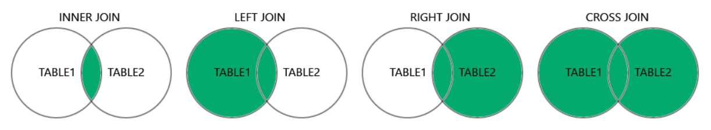
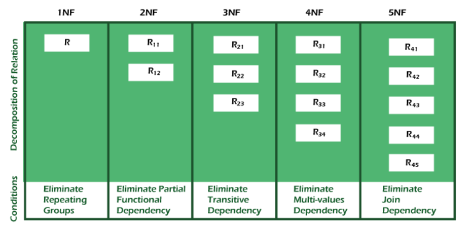

# Interview Preparation on MySQL

## Index
- [Interview Preparation on MySQL](#interview-preparation-on-mysql)
  - [Index](#index)
  - [📝 Practice SQL interview questions](#-practice-sql-interview-questions)
  - [🚀 Topics covered from w3schools](#-topics-covered-from-w3schools)
    - [🍂 what is sql?](#-what-is-sql)
    - [🍂 operators of MySQL](#-operators-of-mysql)
    - [🍂 TABLE creation](#-table-creation)
    - [🍂 SELECT statement.](#-select-statement)
    - [🍂 SELECT DISTINCT statement.](#-select-distinct-statement)
    - [🍂 SELECT \* statement.](#-select--statement)
    - [🍂 WHERE clause.](#-where-clause)
    - [🍂 AND, OR, NOT operators.](#-and-or-not-operators)
    - [🍂 ORDER BY clause.](#-order-by-clause)
    - [🍂 NULL values](#-null-values)
    - [🍂 UPDATE statement](#-update-statement)
    - [🍂 DELETE statement](#-delete-statement)
    - [🍂 LIMIT clause](#-limit-clause)
    - [🍂 MIN() MAX() function](#-min-max-function)
    - [🍂 COUNT() AVG() SUM() function](#-count-avg-sum-function)
    - [🍂 IN operator](#-in-operator)
    - [🍂 BETWEEN operator](#-between-operator)
    - [🍂 LIKE operator](#-like-operator)
    - [🍂 JOIN clause](#-join-clause)
    - [🍂 INNER JOIN](#-inner-join)
    - [🍂 LEFT JOIN](#-left-join)
    - [🍂 RIGHT JOIN](#-right-join)
    - [🍂 CROSS JOIN](#-cross-join)
    - [🍂 FULL JOIN](#-full-join)
    - [🍂 SELF JOIN](#-self-join)
    - [🍂 UNION](#-union)
    - [🍂 GROUP BY](#-group-by)
    - [🍂 INSERT SELECT](#-insert-select)
    - [🍂 CREATE DATABASE](#-create-database)
    - [🍂 DROP DATABASE](#-drop-database)
    - [🍂 DROP TABLE](#-drop-table)
    - [🍂 ALTER TABLE](#-alter-table)
    - [🍂 PRIMARY KEY](#-primary-key)
    - [🍂 FOREIGN KEY](#-foreign-key)
    - [🍂 DEFAULT](#-default)
    - [🍂 AUTO INCREMENT](#-auto-increment)
  - [🚀 Topics covered from other sources](#-topics-covered-from-other-sources)
    - [🍂 LENGTH() function](#-length-function)
    - [🍂 DATEDIFF() function](#-datediff-function)
    - [🍂 ROUND() function](#-round-function)
    - [🍂 IFNULL() function](#-ifnull-function)
    - [🍂 HAVING clause](#-having-clause)
    - [🍂 what is the difference between WHERE and HAVING?](#-what-is-the-difference-between-where-and-having)
    - [🍂 what is the difference between char and varchar datatypes?](#-what-is-the-difference-between-char-and-varchar-datatypes)
    - [🍂 what is normalization?](#-what-is-normalization)
    - [🍂 what is denormalization?](#-what-is-denormalization)
    - [🍂 what is an ALIAS command?](#-what-is-an-alias-command)
    - [🍂 what is ACID properties?](#-what-is-acid-properties)
    - [🍂 A table is given with name and salary. Find the second highest and fifth highest salary.](#-a-table-is-given-with-name-and-salary-find-the-second-highest-and-fifth-highest-salary)

<br><br>

## 📝 Practice SQL interview questions
[LeetCode Interview Questions](https://leetcode.com/studyplan/top-sql-50/)

<br><br>

## 🚀 Topics covered from w3schools

### 🍂 what is sql?
SQL is the standard language for dealing with **Relational Databases**. It is used to insert, search, update, and delete database records. It is not case sensitive.
<br><br><br>

### 🍂 operators of MySQL
- **Comparison operators**: = (equal), <> or != (not equal), > (greater than), < (less than), >= (greater than or equal), <= (less than or equal).
- **Logical operators**: ALL, AND, ANY, BETWEEN, EXISTS, IN, LIKE, NOT, OR, IS NULL.
- **Arithmetic operators**: + (addition), - (subtraction), * (multiplication), / (division), % (modulus).
- **Bitwise operators**: & (bitwise AND), | (bitwise OR), ^ (bitwise XOR).
- **Compound operators**: += (addition assignment), -= (subtraction assignment), *= (multiplication assignment), /= (division assignment), %= (modulus assignment), &= (bitwise AND assignment).
<br><br><br>

### 🍂 TABLE creation
**Note**: These tables will be used in the examples of the following topics.

Customers table:
```sql
CREATE TABLE Customers (
    CustomerID int,
    CustomerName varchar(255),
    ContactName varchar(255),
    Address varchar(255),
    City varchar(255),
    PostalCode varchar(255),
    Country varchar(255)
);

INSERT INTO Customers (CustomerID, CustomerName, ContactName, Address, City, PostalCode, Country)
VALUES
(1, 'Alfreds Futterkiste', 'Maria Anders', 'Obere Str. 57', 'Berlin', '12209', 'Germany'),
(2, 'Ana Trujillo Emparedados y helados', 'Ana Trujillo', 'Avda. de la Constitución 2222', 'México D.F.', '05021', 'Mexico'),
(3, 'Antonio Moreno Taquería', 'Antonio Moreno', 'Mataderos 2312', 'México D.F.', '05023', 'Mexico'),
(4, 'Around the Horn', 'Thomas Hardy', '120 Hanover Sq.', 'London', 'WA1 1DP', 'UK'),
(5, 'Berglunds snabbköp', 'Christina Berglund', 'Berguvsvägen 8', 'Luleå', 'S-958 22', 'Sweden'),
(6, 'Blauer See Delikatessen', 'Hanna Moos', 'Forsterstr. 57', 'Mannheim', '68306', 'Germany'),
(7, 'Blondel père et fils', 'Frédérique Citeaux', '24, place Kléber', 'Strasbourg', '67000', 'France'),
(8, 'Bólido Comidas preparadas', 'Martín Sommer', 'C/ Araquil, 67', 'Madrid', '28023', 'Spain'),
(9, 'Bon app', 'Laurence Lebihan', '12, rue des Bouchers', 'Marseille', '13008', 'France'),
(10, 'Bottom-Dollar Marketse', 'Elizabeth Lincoln', '23 Tsawassen Blvd.', 'Tsawassen', 'T2F 8M4', 'Canada');
```

output:
| CustomerID | CustomerName             | ContactName     | Address             | City      | PostalCode | Country |
|------------|--------------------------|-----------------|---------------------|-----------|------------|---------|
| 1          | Alfreds Futterkiste      | Maria Anders    | Obere Str. 57       | Berlin    | 12209      | Germany |
| 2          | Ana Trujillo Emparedados | Ana Trujillo    | Avda. de la Constitución 2222 | México D.F. | 05021 | Mexico  |
| 3          | Antonio Moreno Taquería  | Antonio Moreno  | Mataderos 2312      | México D.F. | 05023      | Mexico  |
| 4          | Around the Horn          | Thomas Hardy    | 120 Hanover Sq.     | London    | WA1 1DP    | UK      |
| 5          | Berglunds snabbköp       | Christina Berglund | Berguvsvägen 8   | Luleå     | S-958 22   | Sweden  |
| 6          | Blauer See Delikatessen  | Hanna Moos      | Forsterstr. 57      | Mannheim  | 68306      | Germany |
| 7          | Blondel père et fils     | Frédérique Citeaux | 24, place Kléber | Strasbourg | 67000      | France  |
| 8          | Bólido Comidas preparadas | Martín Sommer  | C/ Araquil, 67      | Madrid    | 28023      | Spain   |
| 9          | Bon app                  | Laurence Lebihan | 12, rue des Bouchers | Marseille | 13008      | France  |
| 10         | Bottom-Dollar Marketse   | Elizabeth Lincoln | 23 Tsawassen Blvd. | Tsawassen | T2F 8M4    | Canada  |

<br><br>

Orders table:
```sql
CREATE TABLE Orders (
    OrderID int,
    CustomerID int,
    EmployeeID int,
    OrderDate date,
    ShipperID int
);

INSERT INTO Orders (OrderID, CustomerID, EmployeeID, OrderDate, ShipperID)
VALUES
(10308, 2, 7, '1996-09-18', 3),
(10309, 37, 3, '1996-09-19', 1),
(10310, 77, 8, '1996-09-20', 2),
(10365, 37, 1, '1996-11-16', 1),
(10383, 77, 8, '1996-12-16', 3),
(10355, 37, 9, '1996-11-05', 2);
```

output:
| OrderID | CustomerID | EmployeeID | OrderDate | ShipperID |
|---------|------------|------------|-----------|-----------|
| 10308   | 2          | 7          | 1996-09-18 | 3         |
| 10309   | 37         | 3          | 1996-09-19 | 1         |
| 10310   | 77         | 8          | 1996-09-20 | 2         |
| 10365   | 37         | 1          | 1996-11-16 | 1         |
| 10383   | 77         | 8          | 1996-12-16 | 3         |
| 10355   | 37         | 9          | 1996-11-05 | 2         |

<br><br>


### 🍂 SELECT statement.
The SELECT statement is used to select data from a database. The data returned is stored in a result table, called the result-set.
```sql
SELECT column1, column2, ...
FROM table_name;
```
<br><br>

### 🍂 SELECT DISTINCT statement.
The SELECT DISTINCT statement is used to return only **distinct (different)** values.
```sql
SELECT DISTINCT column1, column2, ...
FROM table_name;
```
<br><br>

### 🍂 SELECT * statement.
The SELECT * statement is used to select all columns from a table.
```sql
SELECT * FROM table_name;
```
<br><br>

### 🍂 WHERE clause.
The WHERE clause is used to filter records. This clause is used to extract only those records that fulfill a specified condition.
```sql
SELECT column1, column2, ...
FROM table_name
WHERE condition;
```
<br>

real example:
```sql
SELECT * FROM Customers
WHERE Country='Mexico';
```
it will return all the customers from Mexico.
<br><br><br>

### 🍂 AND, OR, NOT operators.
The AND, OR, and NOT operators are used to filter records based on more than one condition.
- The AND operator displays a record if all the conditions separated by AND are TRUE.
- The OR operator displays a record if any of the conditions separated by OR is TRUE.
- The NOT operator displays a record if the condition(s) is NOT TRUE.
<br><br>

and operator example:
```sql
SELECT * FROM Customers
WHERE Country='Germany' AND City='Berlin';
```
it will return all the customers from Germany and Berlin.
<br><br>

or operator example:
```sql
SELECT * FROM Customers
WHERE Country='Germany' OR Country='France';
```
it will return all the customers from Germany and France.
<br><br>

not operator example:
```sql
SELECT * FROM Customers
WHERE NOT Country='Germany';
```
it will return all the customers except Germany.
<br><br>

combining all operators:
```sql
SELECT * FROM Customers
WHERE Country='Germany' AND (City='Berlin' OR City='Mannheim');
```
it will return all the customers from Germany and Berlin or Mannheim.

```sql
SELECT * FROM Customers
WHERE Country='Germany' AND NOT City='Berlin';
```
it will return all the customers from Germany except Berlin.
<br><br><br>

### 🍂 ORDER BY clause.
The ORDER BY keyword is used to sort the result-set in ascending or descending order.
```sql
SELECT column1, column2, ...
FROM table_name
ORDER BY column1, column2, ... ASC|DESC;
```
<br>

real example:
```sql
SELECT * FROM Customers
ORDER BY Country;
```
it will return all the customers sorted by country in ascending order.
<br><br><br>

### 🍂 NULL values
A field with a NULL value is a field with no value. If a field in a table is optional, it is possible to insert a new record or update a record without adding a value to this field. Then, the field will be saved with a NULL value.
```sql
SELECT country FROM Customers
WHERE PostalCode IS NULL;
```
it will return all the countries where the postal code is null.
<br><br>

not null example:
```sql
SELECT * FROM Customers
WHERE PostalCode IS NOT NULL;
```
it will return all the customers who have a postal code.
<br><br><br>

### 🍂 UPDATE statement
The UPDATE statement is used to modify the existing records in a table.
```sql
UPDATE Customers
SET Country='USA'
WHERE Country='UK';
```
it will update the country of all the customers from UK to USA.
<br><br><br>

### 🍂 DELETE statement
The DELETE statement is used to delete existing records in a table.
```sql
DELETE FROM Customers
WHERE Country='Germany';
```
it will delete all the customers from Germany.
<br><br><br>

### 🍂 LIMIT clause
The LIMIT clause is used to specify the number of records to return. This clause makes it easy to code multi page results or pagination with SQL, and is very useful on large tables.
```sql
SELECT * FROM Customers
LIMIT 3;
```
it will return the first 3 customers.
<br><br><br>

### 🍂 MIN() MAX() function
The MIN() function returns the smallest value of the selected column.
```sql
SELECT MIN(Price) AS SmallestPrice
FROM Products;
```
it will return the smallest price from the products table.
<br><br>

The MAX() function returns the largest value of the selected column.
```sql
SELECT MAX(Price) AS LargestPrice
FROM Products;
```
it will return the largest price from the products table.
<br><br><br>

### 🍂 COUNT() AVG() SUM() function
The COUNT() function returns the number of rows that matches a specified criteria.
```sql
SELECT COUNT(CustomerID) AS NumberOfCustomers
FROM Customers;
```
it will return the number of customers.
<br><br>

The AVG() function returns the average value of a **numeric column**.
```sql
SELECT AVG(Price) AS AveragePrice
FROM Products;
```
it will return the average price of the products.
<br><br>

The SUM() function returns the total sum of a **numeric column**.
```sql
SELECT SUM(Quantity) AS TotalQuantity
FROM OrderDetails;
```
it will return the total quantity of the order details.
<br><br><br>

### 🍂 IN operator
The IN operator allows us to **specify multiple values in a WHERE clause**.
```sql
SELECT * FROM Customers
WHERE Country IN ('Germany', 'France', 'UK');
```
it will return all the customers from Germany, France, and UK.
<br><br>

not in operator:
```sql
SELECT * FROM Customers
WHERE Country NOT IN ('Germany', 'France', 'UK');
```
it will return all the customers except Germany, France, and UK.
<br><br><br>

### 🍂 BETWEEN operator
The BETWEEN operator selects values within a given range. The values can be numbers, text, or dates.
```sql
SELECT * FROM Products
WHERE Price BETWEEN 10 AND 20;
```
it will return all the products whose price is between 10 and 20.
<br><br>

not between operator:
```sql
SELECT * FROM Products
WHERE Price NOT BETWEEN 10 AND 20;
```
it will return all the products whose price is not between 10 and 20.
<br><br><br>

### 🍂 LIKE operator
The LIKE operator is used in a WHERE clause to search for a specified pattern in a column.
```sql
SELECT * FROM Customers
WHERE CustomerName LIKE 'a%';
```
it will return all the customers whose name starts with 'a'.
<br><br>

not like operator:
```sql
SELECT * FROM Customers
WHERE CustomerName NOT LIKE 'a%';
```
it will return all the customers whose name does not start with 'a'.
<br><br><br>

### 🍂 JOIN clause
A JOIN clause is used to **combine rows** from two or more tables, based on a related column between them.

There are different types of joins:
- **INNER JOIN**: returns records that have matching values in both tables.
- **LEFT JOIN**: returns all records from the left table, and the matched records from the right table.
- **RIGHT JOIN**: returns all records from the right table, and the matched records from the left table.
- **CROSS JOIN**: returns all the records from both tables.
- **FULL JOIN**: returns all records when there is a match in either left or right table.
- **SELF JOIN**: is a regular join, but the table is joined with itself.


<br><br><br>

### 🍂 INNER JOIN
The INNER JOIN keyword selects records that have matching values in both tables.
```sql
SELECT Orders.OrderID, Customers.CustomerName
FROM Orders
INNER JOIN Customers ON Orders.CustomerID = Customers.CustomerID;
```
it will return all the orders with the customer name.

output:
| OrderID | CustomerName           |
|---------|------------------------|
| 10308   | Ernst Handel           |
| 10309   | Ernst Handel           |
| 10310   | Ernst Handel           |
| 10365   | White Clover Markets   |
| 10383   | White Clover Markets   |
| 10355   | Wartian Herkku         |
| 10383   | Wartian Herkku         |
| 10365   | Wartian Herkku         |

<br><br>

### 🍂 LEFT JOIN
The LEFT JOIN keyword returns all records from the left table (table1), and the matched records from the right table (table2). The result is NULL from the right side if there is no match.
```sql
SELECT Customers.CustomerName, Orders.OrderID
FROM Customers
LEFT JOIN Orders ON Customers.CustomerID = Orders.CustomerID;
```
it will return all the customers with their orders.

output:
| CustomerName           | OrderID |
|------------------------|---------|
| Alfreds Futterkiste    | NULL    |
| Ana Trujillo Emparedados | 10308 |
| Antonio Moreno Taquería | 10309 |
| Around the Horn        | NULL    |
| Berglunds snabbköp     | NULL    |
| Blauer See Delikatessen | NULL    |
| Blondel père et fils   | NULL    |
| Bólido Comidas preparadas | NULL    |
| Bon app                | NULL    |

<br><br>

### 🍂 RIGHT JOIN
The RIGHT JOIN keyword returns all records from the right table (table2), and the matched records from the left table (table1). The result is NULL from the left side when there is no match.
```sql
SELECT Customers.CustomerName, Orders.OrderID
FROM Customers
RIGHT JOIN Orders ON Customers.CustomerID = Orders.CustomerID;
```
it will return all the orders with the customer name.

output:
| CustomerName           | OrderID |
|------------------------|---------|
| Ana Trujillo Emparedados | 10308 |
| Antonio Moreno Taquería | 10309 |
| Around the Horn        | 10310    |
| Berglunds snabbköp     | 10365    |
| Blauer See Delikatessen | 10383    |
| Berglunds snabbköp     | 10355    |

<br><br>

### 🍂 CROSS JOIN
The CROSS JOIN keyword returns the Cartesian product of the two tables.
```sql
SELECT Customers.CustomerName, Orders.OrderID
FROM Customers
CROSS JOIN Orders;
```
it will return all the customers with all the orders. It will return the number of customers multiplied by the number of orders. (if there are 10 customers and 5 orders, it will return 50 rows.) It is not recommended to use the CROSS JOIN on large tables.
<br><br><br>

### 🍂 FULL JOIN
The FULL JOIN keyword returns all records when there is a match in either left (table1) or right (table2) table records. MySQL does not support the FULL JOIN, but it can be emulated using the UNION operator.
```sql
SELECT Customers.CustomerName, Orders.OrderID
FROM Customers
LEFT JOIN Orders ON Customers.CustomerID = Orders.CustomerID
UNION
SELECT Customers.CustomerName, Orders.OrderID
FROM Customers
RIGHT JOIN Orders ON Customers.CustomerID = Orders.CustomerID;
```

It will return all the customers with their orders. If the customer has no order, it will return NULL in the order column. If the order has no customer, it will return NULL in the customer column. Also, it will return the customers who have orders and the orders that have customers (in one row). The size of the result will be the sum of the left and right joins. (if there is a match it will return one row, if there is no match it will return two rows, one for the left and one for the right join.)

<br><br>

### 🍂 SELF JOIN
A self join is a regular join, but the table is joined with itself. MySQL does not support the SELF JOIN, but it can be emulated using the various types of joins.

with not equal:
```sql
SELECT A.CustomerName AS CustomerName1, B.CustomerName AS CustomerName2, A.City
FROM Customers A, Customers B
WHERE A.CustomerID <> B.CustomerID /* to avoid the same customer */
AND A.City = B.City;
```
it will return all the customers who are from the same city.

output:
| CustomerName1          | CustomerName2          | City      |
|------------------------|------------------------|-----------|
| Ana Trujillo Emparedados | Antonio Moreno Taquería | México D.F. |
| Antonio Moreno Taquería | Ana Trujillo Emparedados | México D.F. |
| Around the Horn        | Berglunds snabbköp     | London    |
| Berglunds snabbköp     | Around the Horn        | Luleå     |
| Wartian Herkku         | Wartian Herkku         | Oulu      |

<br><br>

### 🍂 UNION
The UNION operator is used to combine the result-set of two or more SELECT statements. UNION removes duplicate records.
```sql
SELECT City FROM Customers
UNION
SELECT City FROM Suppliers
ORDER BY City;
```
it will return all the cities from customers and suppliers.

output:
| City      |
|-----------|
| Berlin    |
| Luleå     |
| Mannheim  |
| México D.F. |
| Oulu      |
| Strasbourg |
| Tsawassen |

<br>

to combine all the cities from customers and suppliers with duplicates:
```sql
SELECT City FROM Customers
UNION ALL
SELECT City FROM Suppliers
ORDER BY City;
```
it will return all the cities from customers and suppliers with duplicates.

output:
| City      |
|-----------|
| Berlin    |
| Luleå     |
| Mannheim  |
| México D.F. |
| México D.F. |
| Oulu      |
| Strasbourg |
| Tsawassen |

<br><br>

### 🍂 GROUP BY
The GROUP BY statement is used in conjunction with the aggregate functions to group the result-set by one or more columns.
```sql
SELECT COUNT(CustomerID), Country
FROM Customers
GROUP BY Country;
```
it will return the number of customers from each country.
<br><br><br>

### 🍂 INSERT SELECT
The INSERT INTO SELECT statement copies data from one table and inserts it into another table.
```sql
INSERT INTO Customers (CustomerName, ContactName, Address, City, PostalCode, Country)
SELECT SupplierName, ContactName, Address, City, PostalCode, Country
FROM Suppliers;
```
it will insert all the suppliers into the customers table with the specified columns.
<br><br>

copy all the columns:
```sql
INSERT INTO Customers
SELECT * FROM Suppliers;
```
it will insert all the suppliers into the customers table.
<br><br><br>

### 🍂 CREATE DATABASE
The CREATE DATABASE statement is used to create a new SQL database.
```sql
CREATE DATABASE mydatabase;
```
it will create a new database named mydatabase.
<br><br><br>

### 🍂 DROP DATABASE
The DROP DATABASE statement is used to drop an existing SQL database.
```sql
DROP DATABASE mydatabase;
```
it will drop the database named mydatabase.
<br><br><br>

### 🍂 DROP TABLE
The DROP TABLE statement is used to drop an existing table in a database.
```sql
DROP TABLE Customers;
```
it will drop the table named Customers.
<br><br><br>

### 🍂 ALTER TABLE
The ALTER TABLE statement is used to add, delete, or modify columns in an existing table.

add a column:
```sql
ALTER TABLE Customers
ADD Email varchar(255);
```
it will add a new column named Email to the Customers table.
<br><br>

delete a column:
```sql
ALTER TABLE Customers
DROP COLUMN Email;
```
it will delete the Email column from the Customers table.
<br><br>

modify a column:
```sql
ALTER TABLE Customers
MODIFY COLUMN ContactName varchar(255) NOT NULL;
```
it will modify the ContactName column to not null in the Customers table.
<br><br><br>

### 🍂 PRIMARY KEY
The PRIMARY KEY constraint uniquely identifies each record in a table.
```sql
CREATE TABLE Persons (
    ID int NOT NULL,
    LastName varchar(255) NOT NULL,
    FirstName varchar(255),
    Age int,
    PRIMARY KEY (ID)
);
```
it will create a new table named Persons with the ID column as the primary key.
<br><br><br>

### 🍂 FOREIGN KEY
A FOREIGN KEY is a key used to link two tables together.
```sql
CREATE TABLE Orders (
    OrderID int NOT NULL,
    OrderNumber int NOT NULL,
    PersonID int,
    PRIMARY KEY (OrderID),
    FOREIGN KEY (PersonID) REFERENCES Persons(ID)
);
```
it will create a new table named Orders with the PersonID column as the foreign key that references the ID column of the Persons table. The PersonID column can only contain values that are available in the ID column of the Persons table.
<br><br><br>

### 🍂 DEFAULT
The DEFAULT constraint is used to set a default value for a column. If no value is specified, the column will take the default value.
```sql
CREATE TABLE Persons (
    ID int NOT NULL,
    LastName varchar(255) NOT NULL,
    FirstName varchar(255),
    Age int,
    City varchar(255) DEFAULT 'Sandnes'
);
```
it will create a new table named Persons with the City column having a default value of Sandnes.
<br><br><br>

### 🍂 AUTO INCREMENT
The AUTO_INCREMENT attribute can be used to generate a unique identity for new rows. It is mostly used with numeric columns. It automatically increases the value of the column by 1 each time a new record is inserted. It starts from 1 by default.
```sql
CREATE TABLE Persons (
    ID int NOT NULL AUTO_INCREMENT,
    LastName varchar(255) NOT NULL,
    FirstName varchar(255),
    Age int,
    PRIMARY KEY (ID)
);
```
it will create a new table named Persons with the ID column as the primary key and auto increment.

<br><br>

<hr>

## 🚀 Topics covered from other sources

### 🍂 LENGTH() function
The LENGTH() function is used to return the length of a string.
```sql
SELECT LENGTH('Hello World');
```
it will return the length of the string Hello World.
<br><br>

compare the length:
```sql
SELECT * FROM Customers
WHERE LENGTH(CustomerName) > 20;
```
it will return all the customers whose name is greater than 20 characters.
<br><br><br>

### 🍂 DATEDIFF() function
The DATEDIFF() function is used to calculate the difference between two dates.
```sql
SELECT DATEDIFF('2021-10-01', '2021-09-01'); /* yyyy-mm-dd */
```
it will return the difference between the two dates.

<br><br>

### 🍂 ROUND() function
The ROUND() function is used to round a number to a specified number of decimal places.
```sql
SELECT ROUND(123.456, 2);
```
it will return the number 123.46 rounded to 2 decimal places.

<br><br>

### 🍂 IFNULL() function
The IFNULL() function is used to replace NULL values with a specified value.
```sql
SELECT CustomerName, IFNULL(ContactName, 'No Contact') AS Contact
FROM Customers;
```
it will return the customer name and the contact name. If the contact name is null, it will return No Contact.

<br><br>

### 🍂 HAVING clause
The HAVING clause is used to filter records based on a group of rows. It is used in combination with the GROUP BY clause.
```sql
SELECT COUNT(CustomerID), Country
FROM Customers
GROUP BY Country
HAVING COUNT(CustomerID) > 2;
```
it will return the number of customers from each country where the number of customers is greater than 2.

<br><br>

### 🍂 what is the difference between WHERE and HAVING?
- **WHERE**: The WHERE clause is used to filter records before any groupings are made. It is used to filter rows based on a specified condition.
- **HAVING**: The HAVING clause is used to filter records after the groupings are made. It is used to filter groups based on a specified condition.

```sql
SELECT COUNT(CustomerID), Country
FROM Customers
WHERE Country='Germany'
GROUP BY Country;
```
it will return the number of customers from Germany.

```sql
SELECT COUNT(CustomerID), Country
FROM Customers
GROUP BY Country
HAVING COUNT(CustomerID) > 2;
```
it will return the number of customers from each country where the number of customers is greater than 2.

<br><br>

### 🍂 what is the difference between char and varchar datatypes?
- **CHAR**: It is fixed-length character data type. It can store up to 255 characters. If the length of the data is less than the specified length, it will be padded with spaces. It is faster than VARCHAR.
- **VARCHAR**: It is variable-length character data type. It can store up to 65535 characters. It will only store the actual length of the data.
<br><br><br>

### 🍂 what is normalization?
Normalization is the process of **organizing data** in a database. This includes creating tables and establishing relationships between those tables according to rules designed both to protect the data and to make the database more flexible **by eliminating redundancy and inconsistent dependency**. It is divided into 5 normal forms.

The normal forms are:
- **First Normal Form (1NF)**: The table is already in 1NF if it has a primary key.
- **Second Normal Form (2NF)**: The table is in 2NF if it is in 1NF and all non-key attributes are fully functional dependent on the primary key. It means that all non-key attributes are dependent on the primary key (may also be dependent on other non-key attributes).
- **Third Normal Form (3NF)**: The table is in 3NF if it is in 2NF and all non-key attributes are non-transitively dependent on the primary key. It means that all non-key attributes are dependent only on the primary key.
- **Fourth Normal Form (4NF)**: The table is in 4NF if it is in 3NF and has no multi-valued dependencies.
- **Fifth Normal Form (5NF)**: The table is in 5NF if it is in 4NF and has no join dependencies.
- **Boyce-Codd Normal Form (BCNF)**: The table is in BCNF if it is in 3NF and for every one of its dependencies X → Y, X is a super key.


<br><br>

The advantages of normalization are:
- **Eliminate Redundancy**: Redundancy means storing the same data multiple times. This increases the storage and decreases the performance.
- **Avoid Inconsistent Dependency**: Inconsistent dependency means storing the same data in multiple places. If the data is not updated in all the places, it will lead to inconsistency.
- **Data Integrity**: It ensures that the data is accurate and consistent.
- **Data Consistency**: It ensures that the data is consistent throughout the database.
- **Data Security**: It ensures that the data is secure and only authorized users can access it.
- **Data Flexibility**: It ensures that the data is flexible and can be easily modified.
- **Data Scalability**: It ensures that the data can be easily scaled up or down.
<br><br>

The disadvantages of normalization are:
- **Complexity**: It makes the database more complex and difficult to understand.
- **Performance**: It decreases the performance of the database because it requires more joins to fetch the data.
- **Storage**: It increases the storage because it requires more tables to store the data.
- **Maintenance**: It increases the maintenance because it requires more tables to maintain the data.
<br><br><br>

### 🍂 what is denormalization?
Denormalization is the process of **increasing the performance of a database** by adding redundant data. It is the reverse process of normalization. It is used to **speed up the database performance** by reducing the number of joins needed to fetch the data. It is used in **read-heavy databases** where the read performance is more important than the write performance.
<br><br><br>

### 🍂 what is an ALIAS command?
The ALIAS command is used to **rename a table or a column**. It is used to give a table or a column a temporary name. It is used when the column name is long or not very readable.
```sql
SELECT column_name AS alias_name
FROM table_name;
```
<br><br>

### 🍂 what is ACID properties?
ACID stands for **Atomicity, Consistency, Isolation, Durability**. It is a set of properties that guarantee that database transactions are processed reliably. It ensures that the database remains consistent and reliable.

The ACID properties are:
- **Atomicity**: It ensures that all the operations in a transaction are completed successfully. If any operation fails, the entire transaction is rolled back.
- **Consistency**: It ensures that the database remains consistent before and after the transaction and the data is valid and follows all the rules.
- **Isolation**: It ensures that the transactions are isolated from each other and the transactions are executed in a serializable order.
- **Durability**: It ensures that the changes made by the transaction are permanent and the changes are saved to the database and are not lost.

<br><br>

### 🍂 A table is given with name and salary. Find the second highest and fifth highest salary.

**using LIMIT and OFFSET**:
```sql
SELECT DISTINCT Salary
FROM Employees
ORDER BY Salary DESC
LIMIT 1 OFFSET 1; /* second highest */

SELECT DISTINCT Salary
FROM Employees
ORDER BY Salary DESC
LIMIT 1 OFFSET 4; /* fifth highest */
```