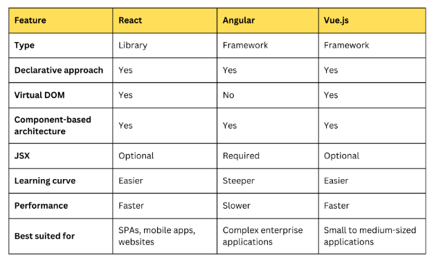
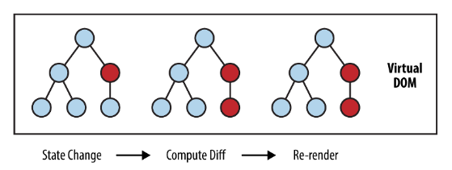
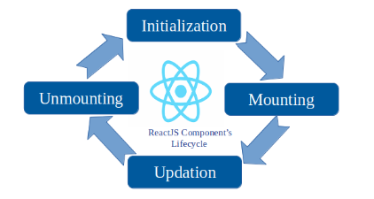

# Interview Preparation on React.js

## Index
- [Interview Preparation on React.js](#interview-preparation-on-reactjs)
  - [Index](#index)
  - [🚀 Topics covered from miscellaneous sources](#-topics-covered-from-miscellaneous-sources)
    - [🍂 What is React?](#-what-is-react)
    - [🍂 What are the features of React?](#-what-are-the-features-of-react)
    - [🍂 What is the one-way data flow in React?](#-what-is-the-one-way-data-flow-in-react)
    - [🍂 What are the differences between React and other js frameworks?](#-what-are-the-differences-between-react-and-other-js-frameworks)
    - [🍂 What is the difference between React and React Native?](#-what-is-the-difference-between-react-and-react-native)
    - [🍂 What is JSX?](#-what-is-jsx)
    - [🍂 What is a component in React?](#-what-is-a-component-in-react)
    - [🍂 What are different types of components in React?](#-what-are-different-types-of-components-in-react)
    - [🍂 What is the difference between controlled and uncontrolled components?](#-what-is-the-difference-between-controlled-and-uncontrolled-components)
    - [🍂 What is the virtual DOM?](#-what-is-the-virtual-dom)
    - [🍂 What is the difference between state and props?](#-what-is-the-difference-between-state-and-props)
    - [🍂 What are the different lifecycle methods in React?](#-what-are-the-different-lifecycle-methods-in-react)
    - [🍂 What are the benefits of using React hooks?](#-what-are-the-benefits-of-using-react-hooks)
    - [🍂 What are the rules of hooks?](#-what-are-the-rules-of-hooks)
    - [🍂 What are the built-in hooks in React?](#-what-are-the-built-in-hooks-in-react)
    - [🍂 What are some of the most popular React libraries and tools?](#-what-are-some-of-the-most-popular-react-libraries-and-tools)
    - [🍂 What are some of the challenges of developing React applications?](#-what-are-some-of-the-challenges-of-developing-react-applications)
    - [🍂 What are some best practices for developing React applications?](#-what-are-some-best-practices-for-developing-react-applications)
    - [🍂 What is a higher-order component (HOC)?](#-what-is-a-higher-order-component-hoc)
    - [🍂 What is testing and error handling in react?](#-what-is-testing-and-error-handling-in-react)
    - [🍂 What is the significance of the key prop in React?](#-what-is-the-significance-of-the-key-prop-in-react)

<br><br>

## 🚀 Topics covered from miscellaneous sources

### 🍂 What is React?
React is a JavaScript library for building user interfaces. It is maintained by Facebook and a community of individual developers and companies. React can be used as a base in the development of single-page or mobile applications.

<br><br>

### 🍂 What are the features of React?
- **JSX**: JSX is a syntax extension for JavaScript. It is used with React to describe what the UI should look like. JSX may remind us of a template language, but it comes with the full power of JavaScript. HTML is a part of JSX, so it is easy to create React elements using JSX.
- **Components**: React is all about components. We need to think of everything as a component. This will help us maintain the code when working on larger scale projects.
- **Unidirectional data flow and Flux**: React implements one-way data flow which makes it easy to reason about our app. Flux is a pattern that helps keeping our data unidirectional.
- **Virtual DOM**: React's virtual DOM efficiently updates the view whenever the state of the component changes. This is done by creating a virtual DOM in memory and then comparing it with the actual DOM.
- **Performance**: React uses a virtual DOM diff implementation for ultra-high performance.
- **Reusability**: React is all about components. We can build our own components and reuse them throughout our application.

<br><br>

### 🍂 What is the one-way data flow in React?
React implements one-way data flow which makes it easy to reason about our app. In React, data flows from parent to child components. This means that the parent component passes data down to child components through props. Child components can also communicate with parent components by passing functions as props.

```jsx
// Parent component
function Parent() {
  const [count, setCount] = useState(0);

  return <Child count={count} setCount={setCount} />;
}

// Child component
function Child({ count, setCount }) {
  return (
    <div>
      <p>Count: {count}</p>
      <button onClick={() => setCount(count + 1)}>Increment</button>
    </div>
  );
}
```

<br>

### 🍂 What are the differences between React and other js frameworks?


<br><br>

### 🍂 What is the difference between React and React Native?
- **React**: React is a JavaScript library for building user interfaces. It is used to build web applications that run in the browser.
- **React Native**: React Native is a framework for building native mobile applications using React. It allows us to build mobile applications for iOS and Android using JavaScript and React.

<br><br>

### 🍂 What is JSX?
JSX is a syntax extension for JavaScript. It is used with React to describe what the UI should look like. JSX may remind us of a template language, but it comes with the full power of JavaScript. HTML is a part of JSX, so it is easy to create React elements using JSX. JSX is not a necessity to write React applications, but it makes the code more readable and easier to write.

```jsx
const element = <h1>Hello, world!</h1>;
```

<br>

### 🍂 What is a component in React?
A component is a reusable piece of code that defines how a part of the user interface should look. Components can be nested inside other components to allow complex applications to be built out of simple building blocks. Components can be either functional or class components.

<br><br>

### 🍂 What are different types of components in React?
- **Functional components**: Functional components are simple functions that take props as an argument and return a React element. Functional components are also known as stateless components because they do not have state.
- **Class components**: Class components are ES6 classes that extend React.Component. Class components have a render method that returns a React element. Class components can have state and lifecycle methods.

```jsx
// Functional component
function Welcome(props) {
  return <h1>Hello, {props.name}</h1>;
}

// Class component
class Welcome extends React.Component {
  render() {
    return <h1>Hello, {this.props.name}</h1>;
  }
}
```

<br>

### 🍂 What is the difference between controlled and uncontrolled components?
- **Controlled components**: In a controlled component, the value of the input element is **controlled by the React component**. The value of the input element is stored in the component's state and is updated when the user types in the input element. Controlled components are useful when we need to validate or manipulate the input value before it is displayed.
- **Uncontrolled components**: In an uncontrolled component, the value of the input element is **controlled by the DOM**. The value of the input element is not stored in the component's state and is updated directly by the user. Uncontrolled components are useful when we need to access the input value directly without going through the component's state.

```jsx
// Controlled component
function ControlledComponent() {
  const [value, setValue] = useState('');

  return (
    <input
      type="text"
      value={value}
      onChange={(e) => setValue(e.target.value)}
    />
  );
}

// Uncontrolled component
function UncontrolledComponent() {
  return <input type="text" />;
}
```
here, the value of the input element is controlled by the React component in the controlled component, and the value of the input element is controlled by the DOM in the uncontrolled component. The input element in the controlled component is updated when the user types in the input element, and the input element in the uncontrolled component is updated directly by the user. The controlled component is useful when we need to validate or manipulate the input value before it is displayed, and the uncontrolled component is useful when we need to access the input value directly without going through the component's state.

<br><br>

### 🍂 What is the virtual DOM?
The virtual DOM is a lightweight copy of the actual DOM. It is a JavaScript representation of the actual DOM. React uses the virtual DOM to keep track of changes to the actual DOM and to update the actual DOM efficiently. When the state of a component changes, React creates a new virtual DOM and compares it with the old virtual DOM to determine what has changed. React then updates the actual DOM with only the changes that need to be made.



<br><br>

### 🍂 What is the difference between state and props?
- **State**: State is a built-in object in React that stores the data that a component needs to render. State is **mutable** and can be changed by the component that owns it. State is used to store data that can change over time, such as user input or the results of an API call.
- **Props**: Props are short for properties and are used to pass data from a parent component to a child component. Props are **immutable** and cannot be changed by the child component. Props are used to pass data from a parent component to a child component, such as the name of a user or the text of a button.

```jsx
// State (functional component)
const [count, setCount] = useState(0);

// props (functional component)
function Welcome(props) {
  return <h1>Hello, {props.name}</h1>;
}
```

<br><br>

### 🍂 What are the different lifecycle methods in React?
- **Mounting**: These methods are called when an instance of a component is being created and inserted into the DOM.
- **Updating**: These methods are called when a component is being re-rendered as a result of changes to its props or state.
- **Unmounting**: This method is called when a component is being removed from the DOM.

```jsx
class MyComponent extends React.Component {
  constructor(props) {
    super(props);
    console.log('constructor');
  }

  componentDidMount() {
    console.log('componentDidMount');
  }

  componentDidUpdate() {
    console.log('componentDidUpdate');
  }

  componentWillUnmount() {
    console.log('componentWillUnmount');
  }

  render() {
    console.log('render');
    return <h1>Hello, world!</h1>;
  }
}
```

output:
```
constructor
render
componentDidMount
componentDidUpdate
componentWillUnmount
```



<br><br>

### 🍂 What are the benefits of using React hooks?
- **Simpler code**: Hooks allow us to use state and other React features without writing a class. This makes our code simpler and easier to read.
- **Reuse logic**: Hooks allow us to reuse stateful logic without changing the component hierarchy. This makes our code more modular and easier to maintain.
- **Easier to understand**: Hooks make it easier to understand how state and other React features work. This makes it easier to reason about our code and debug issues.
- **Better performance**: Hooks can be more efficient than class components because they allow us to avoid unnecessary re-renders.
- **Easier to test and debug**: Hooks make it easier to test and debug our code because they allow us to isolate stateful logic from the component hierarchy.

<br><br>

### 🍂 What are the rules of hooks?
- **Only call hooks at the top level**: Hooks should only be called at the top level of a functional component or custom hook. This ensures that hooks are called in the same order on every render.
- **Only call hooks from functional components or custom hooks**: Hooks should only be called from functional components or custom hooks.

```jsx
// Good
function MyComponent() {
  const [count, setCount] = useState(0);
  return <button onClick={() => setCount(count + 1)}>Increment</button>;
}

// Bad
function MyComponent() {
  if (condition) {
    const [count, setCount] = useState(0);
    return <button onClick={() => setCount(count + 1)}>Increment</button>;
  }
}
```

<br>

### 🍂 What are the built-in hooks in React?
- **useState**: useState is a hook that allows us to add state to functional components. It returns an array with two elements: the current state value and a function that allows us to update the state value.

```jsx
const [count, setCount] = useState(0);

<button onClick={() => setCount(count + 1)}>Increment</button>
```

- **useEffect**: useEffect is a hook that allows us to perform side effects in functional components. It takes a function as an argument and runs that function after every render.

```jsx
useEffect(() => {
  document.title = `You clicked ${count} times`;
}, [count]);
```
here, the useEffect hook runs the function after every render and updates the document title with the current count value.

- **useContext**: useContext is a hook that allows us to access the value of a context object in functional components. (from great parent to great child)

```jsx
// parent component
const MyContext = React.createContext('default value'); // to provide value to great child

// child component
const value = useContext(MyContext); // to consume value from great parent
```
in this example, the useContext hook returns the value of the MyContext object. It is used to pass data through the component tree without having to pass props down manually at every level.

- **useReducer**: useReducer is a hook that allows us to manage complex state logic in functional components. It takes a reducer function and an initial state value as arguments and returns the current state value and a dispatch function. (to handle multiple state transitions in a single component)

```jsx
const initialState = { count: 0 };
const [state, dispatch] = useReducer(reducer, initialState);

function reducer(state, action) {
  switch (action.type) {
    case 'increment':
      return { count: state.count + 1 };
    case 'decrement':
      return { count: state.count - 1 };
    default:
      return state;
  }
}
```
here, the useReducer hook returns the current state value and a dispatch function. It is used to manage complex state logic in functional components.

- **useRef**: useRef is a hook that allows us to create mutable references in functional components. It returns a mutable object with a current property that can be used to store a value. (to access the input element directly without going through the component's state)

```jsx
const inputRef = useRef(null);

<input ref={inputRef} />
```
here, using the useRef hook, we create a mutable reference to the input element. It is used to access the input element directly without going through the component's state.

<br><br>

### 🍂 What are some of the most popular React libraries and tools?
- **React Router**: React Router is a routing library for React that allows us to add routing to our application. It provides a declarative way to navigate between different components.
- **Redux**: Redux is a state management library for React that allows us to manage the state of our application in a predictable way. It provides a single source of truth for the state of our application.
- **Axios**: Axios is a promise-based HTTP client for the browser and Node.js. It allows us to make HTTP requests from our application and handle responses in a simple way.
- **Material-UI**: Material-UI is a popular React component library that provides a set of reusable components that follow Google's Material Design guidelines. It allows us to build beautiful and responsive user interfaces.
- **Jest**: Jest is a testing framework for React that allows us to write and run tests for our application. It provides a simple and easy-to-use API for writing tests and running them in a fast and efficient way.
- **Enzyme**: Enzyme is a testing utility for React that allows us to test React components in isolation. It provides a set of APIs for testing components, including shallow rendering, full rendering, and static rendering.
- **Storybook**: Storybook is a development environment for React that allows us to build and test components in isolation. It provides a way to develop components in isolation and document them in an interactive way.
- **Next.js**: Next.js is a popular React framework that allows us to build server-side rendered React applications. It provides a way to build fast and scalable React applications with minimal configuration.

<br><br>

### 🍂 What are some of the challenges of developing React applications?
- **Complexity**: React applications can become complex as they grow in size and complexity. Managing state, handling side effects, and optimizing performance can be challenging in large React applications.
- **Performance**: React applications can suffer from performance issues if not optimized properly. Rendering large lists, handling complex state logic, and managing side effects can impact the performance of a React application.
- **State management**: Managing state in a React application can be challenging, especially as the application grows in size and complexity. Choosing the right state management solution and managing state transitions can be difficult.
- **Testing**: Testing React applications can be challenging, especially when testing components that have side effects or depend on external libraries. Writing tests that are reliable, maintainable, and easy to understand can be difficult.

<br><br>

### 🍂 What are some best practices for developing React applications?
- **Use functional components**: Use functional components whenever possible to keep you code simple and easy to read.
- **Use hooks**: Use hooks to manage state, handle side effects, and reuse logic in our components.
- **Use context**: Use context to pass data through the component tree without having to pass props down manually at every level.
- **Use prop types**: Use prop types to validate the props that are passed to our components and catch bugs early.
- **Use CSS modules**: Use CSS modules to scope our styles to a specific component and avoid naming conflicts.
- **Use code splitting**: Use code splitting to split our code into smaller chunks and load only the code that is needed for a specific route or component.

<br><br>

### 🍂 What is a higher-order component (HOC)?
A higher-order component is a function that takes a component and returns a new component. Higher-order components are used to share common functionality between components without repeating code. They are a pattern that is used to enhance the behavior of a component.

```jsx
function withLogger(Component) {
  return function WithLogger(props) {
    console.log(`Rendering ${Component.name}`);
    return <Component {...props} />;
  };
}

const EnhancedComponent = withLogger(MyComponent);
```

<br><br>

### 🍂 What is testing and error handling in react?
- **Testing**: Testing is the process of verifying that our application works as expected. There are different types of tests that can be written for React applications, including unit tests, integration tests, and end-to-end tests. Testing helps us catch bugs early, ensure that our application works as expected, and improve the quality of our code.
- **Error handling**: Error handling is the process of handling errors that occur in our application. React provides a way to handle errors using error boundaries. Error boundaries are React components that catch JavaScript errors anywhere in their child component tree and log those errors, display a fallback UI, or perform other actions.

```jsx
class ErrorBoundary extends React.Component {
  constructor(props) {
    super(props);
    this.state = { hasError: false };
  }

  static getDerivedStateFromError(error) {
    return { hasError: true };
  }

  componentDidCatch(error, errorInfo) {
    logErrorToMyService(error, errorInfo);
  }

  render() {
    if (this.state.hasError) {
      return <h1>Something went wrong.</h1>;
    }

    return this.props.children;
  }
}
```
here, the ErrorBoundary component catches JavaScript errors anywhere in its child component tree and displays a fallback UI if an error occurs.

<br><br>

### 🍂 What is the significance of the key prop in React?
The key prop is a special attribute that is used to identify elements in a list. The key prop helps React identify which items have changed, are added, or are removed. When rendering a list of elements, React uses the key prop to keep track of the elements and update the DOM efficiently.

```jsx
const items = ['apple', 'banana', 'cherry'];

<ul>
  {items.map((item, index) => (
    <li key={index}>{item}</li>
  ))}
</ul>
```
here, the key prop is the index of the item in the list. It helps React identify which items have changed, are added, or are removed when rendering the list.

<hr>